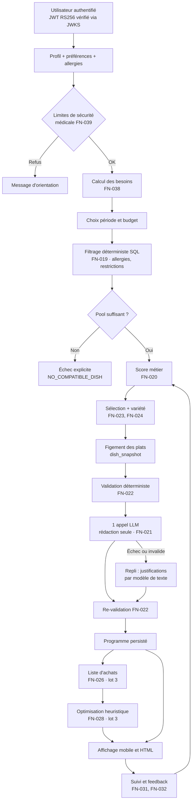

# ARISE — Spécification fonctionnelle du module Nutrition

> **Version 2.0** — révision de faisabilité
> Statut : à valider
> Remplace la version 1.0. Les changements majeurs sont listés au §1.2.

---

## 1. Présentation du document

### 1.1 Objet

Ce document décrit les fonctionnalités du module **Nutrition** du projet ARISE.

Le module permet de générer des programmes alimentaires personnalisés selon le profil, l'objectif, les restrictions et le budget de l'utilisateur, puis d'en déduire une liste d'achats chiffrée et les lieux d'achat les plus adaptés.

Le périmètre couvre :

- l'application mobile ARISE (**React Native + Expo**) ;
- le backend principal ARISE (**NestJS + PostgreSQL**) ;
- le service Nutrition autonome (**FastAPI + PostgreSQL**) ;
- la collecte de prix par saisie manuelle, import de fichiers et — sous condition — scraping ;
- une interface HTML interne d'administration et de supervision.

### 1.2 Ce qui change par rapport à la version 1.0

La version 1.0 décrivait un périmètre techniquement cohérent mais non livrable en un seul lot : elle plaçait dans le « MVP obligatoire » la totalité des fonctionnalités, y compris une chaîne de collecte automatique de prix dont les sources n'ont jamais été vérifiées. Cette version 2.0 conserve la vision, mais la rend exécutable.

| # | Changement | Motif |
|---|---|---|
| 1 | Découpage en **4 lots** livrables indépendamment (§6) | Le « MVP » v1.0 comptait 21 chantiers, dont 4 à risque élevé |
| 2 | **Le lot 2 est livrable sans aucune donnée de prix** | Découple la promesse produit du risque de sourcing |
| 3 | Ordre de collecte inversé : **saisie manuelle → import → scraping** | Le scraping devient une optimisation, plus une fondation |
| 4 | Le scraping est **conditionné à un spike de validation** (§6.5) | Aucune source scrapable n'a été confirmée à ce jour |
| 5 | Ajout du **calcul des besoins énergétiques** (FN-038) | Absent de la v1.0 : le cœur nutritionnel n'était pas spécifié |
| 6 | Ajout des **limites de sécurité médicale** (FN-039) | Absent de la v1.0 : risque produit et juridique |
| 7 | Période MVP plafonnée à **7 jours** | Ramène le catalogue requis de ~400 à ~180 plats |
| 8 | **Un seul appel LLM par programme**, pour la rédaction uniquement | Divise le coût et la latence par ~60, supprime le risque d'hallucination sur la sélection |
| 9 | **pgvector reporté au lot 4** | Sur 200–500 plats, le filtrage SQL + score métier est supérieur |
| 10 | Auth **RS256 + JWKS**, plus de secret symétrique partagé | Le partage de `JWT_SECRET` permettait à FastAPI de forger des tokens ARISE |
| 11 | Modèle de prix unifié : **`price_observations`** | La source devient un attribut, plus une architecture |
| 12 | Les prix deviennent des **fourchettes** (min/médiane/max) | Un prix exact est intenable sur un marché négocié |
| 13 | Articulation explicite avec la table **`menus`** existante (§4.5) | La v1.0 ignorait un module déjà en production |
| 14 | Ajout du **cycle de vie des données** et de la suppression de compte (§4.6) | Obligation légale, absente de la v1.0 |
| 15 | Les plats sont **figés** dans le programme généré (FN-023) | Sinon l'historique change rétroactivement |

Une table de correspondance v1.0 → v2.0 figure au §17.

---

## 2. Objectifs du module

Le module Nutrition doit permettre à un utilisateur de :

1. définir son objectif nutritionnel ;
2. renseigner ses préférences alimentaires ;
3. déclarer ses allergies et restrictions ;
4. indiquer son budget ;
5. sélectionner une période ;
6. recevoir un programme alimentaire couvrant le matin, le midi et le soir ;
7. consulter les détails de chaque plat ;
8. obtenir la liste complète des ingrédients nécessaires ;
9. savoir où acheter les ingrédients ;
10. comparer les prix disponibles ;
11. privilégier les marchés locaux lorsque le budget est faible ;
12. demander le remplacement d'un repas ;
13. indiquer s'il a suivi ou refusé une recommandation ;
14. consulter l'historique de ses programmes alimentaires.

Les objectifs 1 à 7 et 12 à 14 sont atteints au **lot 2**, sans dépendance à la donnée de prix.
Les objectifs 8 à 11 sont atteints au **lot 3**.

---

## 3. Décisions structurantes

Ces décisions conditionnent l'ensemble du document. Les remettre en cause impose de réviser la spécification.

| ID | Décision | Justification | Conséquence si ignorée |
|---|---|---|---|
| **D-01** | Le catalogue de plats (`dishes`) est **la source de vérité unique**, hébergée par FastAPI | Un même concept ne peut exister à deux endroits | Deux catalogues divergents sous 6 mois |
| **D-02** | La table `menus` de NestJS n'est **pas migrée** : elle référencera progressivement `dishes` (*strangler fig*, §4.5) | Ne pas casser une fonctionnalité en production | Régression sur le programme coaché |
| **D-03** | Authentification par **JWT RS256 + JWKS**. FastAPI ne détient que la clé publique | Un secret symétrique partagé permet la forge de tokens | Compromission totale de l'auth ARISE |
| **D-04** | L'identifiant utilisateur côté FastAPI est un **`external_user_id` opaque** (string), sans clé étrangère vers ARISE | Rend le service réutilisable hors ARISE | Couplage définitif, réutilisation impossible |
| **D-05** | L'autorisation d'accès est portée par un claim **`entitlements`** dans le JWT | Évite de dupliquer la logique d'abonnement | Règles métier ARISE dans FastAPI |
| **D-06** | **La sélection des plats est 100 % déterministe** (SQL + score métier). Le LLM ne rédige que la justification | Sécurité alimentaire, coût, reproductibilité | Hallucinations sur des données de santé |
| **D-07** | **Un seul appel LLM par programme généré**, jamais un par repas | 63 appels pour 21 jours : coût et latence rédhibitoires | Coût IA non maîtrisé |
| **D-08** | L'unité atomique de la donnée de prix est la **`price_observation`** ; la méthode de collecte est un attribut | Permet d'ajouter le scraping sans réécrire le pipeline | Pipeline à réécrire au lot 4 |
| **D-09** | Les prix sont exposés en **fourchette** (`min` / `médiane` / `max`) avec date et confiance | Marché négocié, forte volatilité | Promesse de coût intenable |
| **D-10** | Le MVP couvre **une ville** (Antananarivo) ; le schéma est multi-villes dès l'origine | Les prix sont hyper-locaux | Migration lourde sur toutes les tables prix |
| **D-11** | Les valeurs nutritionnelles d'un plat sont **calculées** depuis ses ingrédients, jamais saisies | Cohérence et recalcul possible | Données incohérentes et non corrigeables |
| **D-12** | Le seed du catalogue est **versionné dans le dépôt** (YAML/CSV) et appliqué par script idempotent | Relecture en PR, reproductibilité dev/staging/prod | 3 semaines de saisie manuelle non traçable |

### Hypothèse à confirmer

> **H-01 — Portée de la réutilisation.** Ce document suppose que le service Nutrition a vocation à être **réutilisable hors ARISE** (autre produit, autre client). C'est ce qui justifie D-04 (identifiant opaque) et renforce D-03 (JWKS).
> Si la réutilisation visée se limite à l'écosystème Python (bibliothèques d'ingestion, d'IA), D-04 peut être assoupli — mais le conserver ne coûte rien et garde l'option ouverte.
> **À trancher avant le lot 1.**

---

## 4. Architecture

### 4.1 Périmètre technique

| Composant | Technologie | Responsabilités | Lot |
|---|---|---|---|
| Application mobile | React Native + Expo | Profil, programme, liste d'achats, feedback | 2–3 |
| Backend principal | NestJS + PostgreSQL | Comptes, authentification, rôles, abonnements, données générales | 1 |
| Service Nutrition | FastAPI + PostgreSQL | Profil nutritionnel, catalogue, génération, prix, listes d'achats | 1–4 |
| Interface admin | FastAPI + Jinja2 + HTML/CSS | Outil **interne** de saisie, supervision et debug | 1–4 |
| Fournisseur IA | OpenRouter (abstrait derrière `LLMClient`) | Rédaction des justifications uniquement | 2 |
| Planification | APScheduler (in-process) puis Celery si nécessaire | Tâches périodiques | 4 |
| Recherche vectorielle | PostgreSQL + pgvector | Recherche sémantique — **différée** | 4 |

> **Note sur l'interface HTML.** Elle est un **outil interne** (saisie du catalogue, supervision, debug), pas un produit. L'administration destinée aux administrateurs ARISE reste dans l'espace `(admin)` de l'application mobile, qui existe déjà. Ne pas maintenir deux back-offices produit.

### 4.2 Autonomie du service Nutrition

Le service FastAPI fonctionne indépendamment du backend NestJS pour tous les traitements nutritionnels. Il dispose de :

- sa propre base PostgreSQL — **aucune clé étrangère vers la base ARISE** ;
- ses propres migrations Alembic ;
- ses propres tâches planifiées, logs et connecteurs ;
- son propre accès au fournisseur IA ;
- sa propre interface HTML interne.

**Aucun appel synchrone vers NestJS pendant une génération.** Les seuls échanges inter-services sont asynchrones et rares (§4.6).

### 4.3 Authentification (D-03)

**Chaîne nominale**

1. l'utilisateur s'authentifie dans ARISE via NestJS ;
2. NestJS signe un JWT en **RS256** avec sa clé privée ;
3. l'application mobile transmet ce JWT au service FastAPI ;
4. FastAPI récupère et met en cache la clé publique via l'endpoint **JWKS** de NestJS ;
5. FastAPI vérifie signature, expiration, `iss` et `aud` ;
6. FastAPI applique ses propres autorisations à partir des claims.

**Payload attendu**

```json
{
  "sub": "9f1c…",
  "email": "…",
  "role": "user",
  "entitlements": ["nutrition"],
  "iss": "arise-api",
  "aud": ["arise-nutrition"],
  "iat": 1770000000,
  "exp": 1770007200
}
```

**Règles**

- FastAPI **rejette** tout token dont `aud` ne le désigne pas ;
- FastAPI **ne détient jamais** la clé privée de signature ;
- la clé publique est mise en cache avec TTL, et rechargée sur `kid` inconnu (rotation de clé sans redéploiement) ;
- `sub` est stocké tel quel comme `external_user_id` (D-04) ; aucune donnée d'identité ARISE (email, nom) n'est persistée côté FastAPI ;
- l'accès aux fonctionnalités payantes est décidé par le claim `entitlements` (D-05), jamais recalculé par FastAPI ;
- un décalage jusqu'au prochain rafraîchissement de token (2 h) est acceptable pour un abonnement.

**Migration NestJS requise (lot 1)** — génération d'une paire de clés, passage de `HS256` à `RS256`, ajout de `iss` / `aud` / `entitlements` au payload, exposition de `GET /.well-known/jwks.json`. Période de double vérification (accepter HS256 et RS256) le temps que les tokens en circulation expirent.

### 4.4 Séparation des responsabilités

**NestJS reste responsable de** : inscription, connexion, vérification d'email, renouvellement de token, rôles généraux, profil global ARISE, abonnements et paiements, progression globale.

**FastAPI est responsable de** : profil nutritionnel, préférences, allergies, restrictions, objectifs, besoins énergétiques, catalogue d'ingrédients et de plats, vendeurs et points de vente, observations de prix, génération des programmes, listes d'achats, historique et feedback, administration HTML interne.

### 4.5 Articulation avec la table `menus` existante (D-02)

Le backend NestJS expose déjà une table `menus` (contenu éditorial rédigé par un coach, rattaché à un `programme` par jour/mois), consommée par le tableau de bord et par les écrans mobiles existants.

Ce sont **deux domaines distincts qui partagent un concept** :

- `menus` (NestJS) = contenu **éditorial**, choisi par un coach → conserve sa raison d'être ;
- `meal_plans` (FastAPI) = programme **personnalisé et généré** ;
- **`dishes`** = le plat lui-même → source unique (D-01).

**Trajectoire**

| Étape | Action | Lot |
|---|---|---|
| 1 | FastAPI devient propriétaire du catalogue `dishes`. `menus` n'est pas modifiée. | 1 |
| 2 | Ajout d'une colonne `dishId` **nullable** sur `menus`. L'admin peut sélectionner un plat du catalogue au lieu de saisir du texte libre. Les deux modes coexistent. | 2 |
| 3 | Backfill des menus existants vers des `dishes`. Les champs texte libre passent en lecture seule. | 3 |
| 4 | Suppression des champs texte libre de `menus`. | 4 |

**Règle d'expérience** : côté mobile, un **seul** composant de carte de plat et un **seul** écran de détail, quelle que soit la provenance. L'utilisateur ne doit jamais percevoir deux expériences nutrition distinctes.

**Règle de prudence** : ne rien supprimer côté NestJS avant que le nouveau flux soit éprouvé en production.

### 4.6 Cycle de vie et souveraineté des données

Les données de santé (poids, taille, allergies, localisation) sont dupliquées dans une seconde base. Cette duplication impose des règles explicites.

| Donnée | Maître | Copie | Synchronisation |
|---|---|---|---|
| Identité (email, nom) | NestJS | **aucune** | — |
| Poids, taille, âge, sexe | FastAPI | — | Saisie directe dans le module Nutrition |
| Allergies, restrictions, préférences | FastAPI | — | Saisie directe |
| Droits d'accès | NestJS | — | Claim `entitlements` du JWT |

**Suppression de compte.** À la suppression d'un compte ARISE, NestJS émet un événement `user.deleted` vers FastAPI (webhook signé, avec file de reprise et rejeu en cas d'échec). FastAPI :

1. supprime le profil, les préférences, les allergies et la localisation ;
2. anonymise les programmes et feedbacks (`external_user_id` → `NULL`, conservation des statistiques agrégées) ;
3. journalise l'opération.

**Rétention.** Programmes et feedbacks anonymisés : conservation illimitée (statistiques). Données de profil : supprimées immédiatement. Journaux techniques : 90 jours.

**Export.** Un utilisateur peut demander l'export de ses données nutritionnelles au format JSON.

---

## 5. Acteurs

### 5.1 Utilisateur
Configure son profil, demande un programme, consulte ses menus, suit sa liste d'achats, donne son avis.

### 5.2 Administrateur
Gère les plats, ingrédients, allergènes, tags, vendeurs, imports de prix, sources et supervision.

### 5.3 Nutritionniste / validateur de contenu
**Rôle obligatoire dès le lot 1.** Vérifie les plats et leurs valeurs nutritionnelles, **valide les allergènes**, approuve ou refuse, corrige les quantités, publie.
Son identifiant est enregistré dans `dishes.validated_by` : c'est la traçabilité de responsabilité en cas d'incident.

### 5.4 Contributeur de prix
Saisit des prix observés sur le terrain (administrateur au lot 3, utilisateur volontaire en version ultérieure).

### 5.5 Worker de collecte
Collecte produits, prix et disponibilité depuis les sources autorisées. **Lot 4, sous condition (§6.5).**

### 5.6 Service IA
Reçoit uniquement des données présélectionnées et produit un texte de justification structuré. **Il ne sélectionne rien** (D-06, §16).

---

# 6. Découpage en lots

## 6.1 Principe

Chaque lot est **livrable et démontrable indépendamment**. Un lot non terminé ne bloque jamais la démonstration du précédent.

Le point critique : **le lot 2 délivre la promesse produit sans une seule donnée de prix.** Le budget y est traité comme un filtre sur un coût estimé saisi sur le plat. Cela découple la valeur du module du principal risque projet (§6.5).

## 6.2 Lot 1 — Fondations

| Contenu | FN |
|---|---|
| Migration auth RS256 + JWKS côté NestJS, vérification côté FastAPI | §4.3 |
| Schéma de base + Alembic initialisé | §9 |
| Profil nutritionnel, préférences, allergies, restrictions | FN-001 → FN-004 |
| Catalogue d'ingrédients (allergènes + valeurs nutritionnelles) | FN-007 |
| Catalogue de plats + workflow de validation | FN-008, FN-009 |
| Seed versionné (~150 ingrédients, ~180 plats) | FN-040 |
| Interface HTML interne minimale (saisie et validation) | FN-034 |
| Journalisation, gestion d'erreurs, `/health` et `/ready` | FN-036, FN-037 |

**Démontrable** : un nutritionniste saisit, valide et publie des plats ; le catalogue est requêtable par API.

## 6.3 Lot 2 — Générateur

| Contenu | FN |
|---|---|
| Calcul des besoins énergétiques et macros | **FN-038** |
| Limites de sécurité médicale | **FN-039** |
| Filtrage déterministe (allergies, restrictions, type de repas) | FN-019 |
| Score métier et sélection | FN-020 |
| Génération 3 repas × 1 à 7 jours | FN-023 |
| Gestion de la variété | FN-024 |
| Rédaction LLM de la justification (1 appel/programme) | FN-021 |
| Validation finale déterministe | FN-022 |
| Remplacement d'un repas, regénération | FN-025 |
| Suivi, feedback, historique | FN-031 → FN-033 |
| Écrans mobiles | MOB-001 → MOB-006, MOB-009 |
| Colonne `dishId` sur `menus` (NestJS) | §4.5 étape 2 |

**Démontrable** : un utilisateur obtient un programme de 7 jours cohérent avec son objectif calorique, sans allergène, varié, avec une justification rédigée. **Le budget est filtré sur le coût estimé du plat ; aucune donnée de prix réelle n'est requise.**

## 6.4 Lot 3 — Achats

| Contenu | FN |
|---|---|
| Vendeurs et points de vente | FN-010 |
| Produits commerciaux | FN-011 |
| **Saisie manuelle de prix** (priorité 1) | FN-015 |
| Import CSV / XLSX (priorité 2) | FN-014 |
| Normalisation des unités et conversions par ingrédient | FN-012 |
| Historique et fraîcheur des prix | FN-016 |
| Génération de la liste d'achats | FN-026 |
| Sélection des conditionnements | FN-027 |
| Optimisation heuristique des achats | FN-028 |
| Adaptation au budget faible | FN-005, FN-029 |
| Comparaison des vendeurs | FN-030 |
| Écrans mobiles | MOB-007, MOB-008 |

**Démontrable** : une liste de courses chiffrée en fourchettes, regroupée, avec des lieux d'achat.

## 6.5 Lot 4 — Automatisation *(conditionnel)*

> ### ⚠ Condition de démarrage — SPIKE-01
>
> **Ce lot ne démarre pas tant que le spike suivant n'a pas abouti.**
>
> **Objectif** : vérifier qu'au moins deux sources de prix malgaches sont réellement scrapables.
> **Effort** : une demi-journée, script jetable, aucun code conservé.
> **Critères de succès**, pour chaque source candidate :
>
> 1. les prix figurent dans le HTML servi (pas uniquement dans une application cliente non interceptable) ;
> 2. le catalogue accessible couvre au moins 30 ingrédients de notre référentiel ;
> 3. la structure est stable sur trois relevés espacés d'une semaine ;
> 4. les CGU et le `robots.txt` n'interdisent pas la collecte.
>
> **Si moins de deux sources satisfont ces critères** : le lot 4 est abandonné en l'état. La collecte reste manuelle et par import, et l'effort est réinvesti dans la contribution communautaire (§15).
> **C'est une issue acceptable** : elle est prévue par l'architecture (D-08), et aucun lot antérieur n'en dépend.

| Contenu | FN |
|---|---|
| Connecteurs de scraping (un par source) | FN-013 |
| Planification et reprise sur échec | FN-017 |
| Indexation vectorielle pgvector | FN-018 |
| Recherche sémantique hybride | FN-019b |
| Optimisation par distance réelle | FN-028b |
| Tableau de bord de supervision complet | FN-035 |

## 6.6 Volumétrie du catalogue — pourquoi le MVP est à 7 jours

Sur une période de N jours, il faut ≥ N plats distincts par type de repas pour respecter la règle de non-répétition. Mais les filtres bloquants (allergies, restrictions, budget, aliments refusés) éliminent typiquement **40 à 70 %** du catalogue pour un utilisateur donné. Pour que le générateur ne soit jamais bloqué, le pool survivant doit valoir **3 à 5×** le nombre de créneaux.

| Période | Créneaux / type | Pool post-filtrage requis | Catalogue requis |
|---|---|---|---|
| **7 jours** | 7 | 25–35 | **~180 plats** |
| 14 jours | 14 | 45–70 | ~330 plats |
| 21 jours | 21 | 65–100 | ~450 plats |

Le seed du catalogue est le véritable goulot d'étranglement du lot 2. Plafonner à 7 jours divise cet effort par 2,5. Les périodes de 14 et 21 jours sont débloquées **automatiquement** dès que le catalogue atteint le seuil — c'est une variable de configuration, pas un développement.

---

# 7. Fonctionnalités détaillées

## FN-001 — Profil nutritionnel · Lot 1

### Description
L'utilisateur crée et modifie son profil nutritionnel.

### Données

| Champ | Type | Obligatoire | Note |
|---|---|---|---|
| `external_user_id` | string | oui | `sub` du JWT (D-04) |
| `goal` | enum | oui | voir ci-dessous |
| `weight_kg` | decimal | oui | 25–300 |
| `height_cm` | decimal | oui | 100–250 |
| `birth_date` | date | oui | requis pour FN-038 |
| `sex` | enum `male` / `female` / `unspecified` | oui | requis pour FN-038 |
| `activity_level` | enum | oui | 5 niveaux (FN-038) |
| `meals_per_day` | int | oui | 3 à 5 |
| `household_size` | int | oui | défaut 1 |
| `daily_budget` | decimal | non | lot 3 |
| `currency` | string | oui | défaut `MGA` |
| `city`, `district` | string | non | lot 3 |
| `travel_radius_km` | decimal | non | lot 4 |
| `created_at`, `updated_at` | timestamptz | oui | |

### Objectifs disponibles
`weight_loss` · `weight_maintenance` · `weight_gain` · `muscle_gain` · `balanced_diet` · `habit_improvement`

### Règles métier
- l'objectif est obligatoire ;
- le budget ne peut pas être négatif ;
- poids et taille strictement positifs, dans les bornes indiquées ;
- `sex = unspecified` → la formule féminine est utilisée (estimation conservatrice, minorant l'apport) ;
- toute modification de poids, taille, âge ou activité **recalcule** les besoins (FN-038) et **marque comme obsolètes** les programmes actifs, sans les supprimer ;
- les modifications sont historisées dans `nutrition_profile_history`.

### Critères d'acceptation
- création et modification possibles ;
- profil lié à l'`external_user_id` du JWT, jamais à un identifiant fourni par le client ;
- données invalides refusées avec un message explicite ;
- un utilisateur ne peut accéder qu'à son propre profil (test API obligatoire, §13).

---

## FN-002 — Préférences alimentaires · Lot 1

### Description
L'utilisateur précise les aliments et types de cuisine qu'il apprécie ou refuse.

### Préférences
- aliments favoris · aliments refusés ;
- cuisines préférées · plats locaux préférés ;
- priorité aux produits locaux ;
- plats rapides · plats faciles · plats économiques ;
- fréquence maximale d'un aliment ;
- préférence végétarienne ;
- types de protéines préférés.

### Règles métier
- **une préférence n'est jamais bloquante** : elle module le score (FN-020) ;
- **un aliment refusé est bloquant** : c'est une exclusion dure, au même titre qu'une restriction ;
- la distinction préférence / refus / allergie doit être visible dans l'interface (MOB-003).

---

## FN-003 — Allergies · Lot 1 · 🔴 Criticité maximale

### Description
L'utilisateur déclare une ou plusieurs allergies. **C'est la fonctionnalité la plus critique du module.**

### Allergènes gérés
arachide · fruits à coque · lait · œuf · poisson · crustacés · mollusques · soja · gluten · sésame · moutarde · céleri · sulfites · lupin

### Règles métier
- les allergies sont des **contraintes bloquantes absolues** ;
- aucun plat contenant un allergène déclaré ne peut être proposé, y compris à l'état de trace connue ;
- les **allergènes indirects** (via un ingrédient composé) sont pris en compte par propagation depuis `ingredients.allergens` ;
- la vérification est faite **avant** la sélection **et** après la rédaction LLM (FN-022) ;
- la source de l'information allergène est conservée (`ingredients.allergen_source`, `allergen_verified_by`, `allergen_verified_at`) ;
- **un ingrédient dont les allergènes ne sont pas vérifiés rend tout plat qui l'utilise non publiable** ;
- si aucun plat compatible n'existe pour un créneau, le système **échoue explicitement** (FN-037) plutôt que de proposer un plat douteux.

### Conséquence opérationnelle
Au lancement, tant que le nutritionniste n'a pas validé le catalogue, la quasi-totalité des plats est inéligible. **La validation allergènes doit être terminée avant la fin du lot 1**, sinon le lot 2 ne peut pas être démontré. C'est un jalon bloquant, pas une tâche de finition.

### Critères d'acceptation
- un utilisateur allergique à l'arachide ne reçoit **aucun** plat contenant de l'arachide, directement ou indirectement ;
- la génération est refusée lorsque les données d'un plat ne garantissent pas sa compatibilité ;
- toute violation détectée par FN-022 est journalisée en `ERROR` avec alerte.

---

## FN-004 — Restrictions alimentaires · Lot 1

### Restrictions prises en charge
végétarien · végétalien · sans porc · sans alcool · sans lactose · sans gluten · restrictions religieuses · aliments interdits · restrictions personnalisées

### Règles métier
- les restrictions sont appliquées **avant** toute sélection ;
- le système distingue formellement préférence, refus et interdiction ;
- une restriction personnalisée est **normalisée** vers un ou plusieurs ingrédients/tags connus lors de la saisie ; si elle n'est pas normalisable, elle est signalée à l'administrateur et n'est **pas** appliquée silencieusement ;
- les plats incompatibles sont exclus du pool avant scoring.

---

## FN-038 — Calcul des besoins énergétiques · Lot 2 · 🆕

### Description
Le système calcule les besoins caloriques et la répartition en macronutriments à partir du profil. **C'est le cœur nutritionnel du module ; il était absent de la version 1.0.**

### Métabolisme de base — Mifflin-St Jeor

```text
Homme :  BMR = 10 × poids(kg) + 6,25 × taille(cm) − 5 × âge + 5
Femme :  BMR = 10 × poids(kg) + 6,25 × taille(cm) − 5 × âge − 161
```

### Dépense énergétique totale

```text
TDEE = BMR × facteur_activité
```

| Niveau d'activité | Facteur |
|---|---|
| Sédentaire | 1,20 |
| Légèrement actif (1–3 séances/sem.) | 1,375 |
| Modérément actif (3–5 séances/sem.) | 1,55 |
| Très actif (6–7 séances/sem.) | 1,725 |
| Extrêmement actif | 1,90 |

### Cible calorique par objectif

| Objectif | Cible | Plancher de sécurité |
|---|---|---|
| Perte de poids | TDEE − 20 % | jamais < BMR, et jamais < 1 200 kcal (F) / 1 500 kcal (H) |
| Maintien | TDEE | — |
| Prise de poids | TDEE + 15 % | — |
| Prise de masse musculaire | TDEE + 12 % | — |
| Alimentation équilibrée | TDEE | — |
| Amélioration des habitudes | TDEE | — |

> Le plancher de sécurité est **impératif** : si la cible calculée passe sous le plancher, elle est relevée au plancher et l'utilisateur en est informé.

### Macronutriments

| Objectif | Protéines | Lipides | Glucides |
|---|---|---|---|
| Perte de poids | 1,8 g/kg | 25 % des kcal | reste |
| Maintien / équilibré | 1,2 g/kg | 30 % des kcal | reste |
| Prise de poids | 1,6 g/kg | 30 % des kcal | reste |
| Prise de masse | 2,0 g/kg | 25 % des kcal | reste |

Plancher lipidique absolu : **0,8 g/kg**.

### Répartition journalière

| Repas | Part de l'apport | Ajustement |
|---|---|---|
| Petit-déjeuner | 25 % | ±5 pts configurable |
| Déjeuner | 35 % | |
| Dîner | 30 % | |
| Collations | 10 % réparti | uniquement si `meals_per_day > 3` |

### Règles métier
- ces valeurs sont des **estimations statistiques**, pas une prescription médicale (voir FN-039) ;
- un jour généré est valide si son total calorique est dans une tolérance de **±15 %** de la cible ;
- un repas est valide si son apport est dans une tolérance de **±25 %** de sa part cible ;
- le calcul est recalculé à chaque modification du profil et **stocké** dans `nutrition_targets` avec sa date, pour que l'historique reste interprétable ;
- la formule utilisée et sa version sont enregistrées (`formula = "mifflin_st_jeor"`, `formula_version`).

### Critères d'acceptation
- un programme « prise de masse » apporte mesurablement plus de calories qu'un programme « perte de poids » pour un même profil — **test automatisé obligatoire** ;
- aucun programme généré ne descend sous le plancher de sécurité ;
- l'utilisateur voit sa cible calorique et son apport réel par jour (MOB-005).

---

## FN-039 — Limites de sécurité médicale · Lot 2 · 🆕

### Description
Le module produit des recommandations alimentaires. Il doit refuser explicitement les situations qui relèvent d'un suivi médical.

### Cas de refus de génération

| Situation | Comportement |
|---|---|
| Âge < 16 ans | Refus. Message orientant vers un professionnel de santé. |
| IMC < 16 ou IMC > 40 | Refus. Message d'orientation. |
| Objectif de perte de poids avec IMC < 18,5 | Refus. |
| Grossesse ou allaitement déclaré | Refus au MVP. Orientation. |
| Pathologie déclarée (diabète, insuffisance rénale, etc.) | Refus au MVP. Orientation. |

Un champ déclaratif optionnel permet à l'utilisateur de signaler grossesse, allaitement ou pathologie. Il n'est jamais présélectionné.

### Avertissement obligatoire
Un avertissement non désactivable est affiché à la première configuration du profil et reste accessible depuis l'écran de profil :

> *« Les programmes proposés sont des suggestions générées automatiquement à partir de données déclaratives. Ils ne constituent pas un avis médical ni une prescription diététique. En cas de pathologie, de grossesse, de traitement en cours ou de doute, consultez un professionnel de santé. Les informations sur les allergènes proviennent de nos fiches ingrédients ; vérifiez toujours les étiquettes des produits que vous achetez. »*

### Règles métier
- l'avertissement doit avoir été affiché au moins une fois avant la première génération (`disclaimer_accepted_at` stocké) ;
- l'avertissement sur les allergènes est **répété** sur l'écran de détail d'un plat (MOB-006) et dans la liste d'achats (MOB-007) ;
- aucun refus n'est silencieux : le motif est toujours affiché.

---

## FN-005 — Budget · Lots 2 et 3

### Types de budget
budget quotidien · budget hebdomadaire · budget de la période · par personne · du foyer

### Comportement par lot

**Lot 2 — sans données de prix.** Le budget filtre sur `dishes.estimated_cost`, un coût indicatif par portion saisi lors de la création du plat (classes : `économique` / `moyen` / `élevé`, plus une valeur numérique optionnelle). L'interface indique clairement qu'il s'agit d'une **estimation indicative**.

**Lot 3 — avec observations de prix.** Le coût prévisionnel est calculé depuis la liste d'achats réelle, exprimé en fourchette (D-09).

### Règles métier
- le coût prévisionnel est toujours accompagné de son **niveau de fiabilité** : `estimé` (lot 2), `observé` (lot 3) ;
- un prix dont l'observation est antérieure au seuil de fraîcheur (FN-016) est signalé visuellement ;
- lorsque le budget ne peut pas être respecté, le système **l'indique explicitement** et propose une alternative moins chère plutôt que d'échouer ;
- lorsque le budget est faible, la stratégie FN-029 s'applique ;
- **le budget ne prime jamais sur les contraintes de sécurité alimentaire** (FN-003, FN-004) ni sur le plancher calorique (FN-038).

---

## FN-006 — Période du programme · Lot 2

### Périodes disponibles

| Période | Disponibilité |
|---|---|
| 1 jour | Lot 2 |
| 7 jours | Lot 2 |
| 14 jours | Débloqué quand le catalogue ≥ 330 plats publiés |
| 21 jours | Débloqué quand le catalogue ≥ 450 plats publiés |
| Personnalisée | Version ultérieure |

Le déblocage est piloté par une **configuration** (`max_plan_days`), pas par du code.

### Données
date de début · date de fin · nombre de jours · repas par jour · nombre de personnes

### Règles métier
- date de fin ≥ date de début ;
- durée ≤ `max_plan_days` (configurable, défaut 7) ;
- chaque jour contient au minimum petit-déjeuner, déjeuner et dîner ;
- les quantités sont multipliées par `household_size` ;
- si la période demandée dépasse ce que le catalogue permet, le système propose la période maximale possible avec un message explicite.

---

## FN-007 — Catalogue des ingrédients · Lot 1

### Données

| Champ | Note |
|---|---|
| `id`, `name`, `slug` | |
| `aliases` | pour la réconciliation des imports et du scraping |
| `category` | voir liste |
| `reference_unit` | `g` \| `ml` \| `unit` |
| `kcal_100`, `protein_100`, `carbs_100`, `fat_100`, `fiber_100` | pour 100 g/ml |
| `nutrition_source` | **obligatoire** — table de composition d'origine |
| `allergens[]` | |
| `allergen_source`, `allergen_verified_by`, `allergen_verified_at` | **obligatoires pour publication** |
| `restriction_flags[]` | végétarien, végétalien, porc, alcool, lactose, gluten… |
| `locally_available`, `seasonality[]` | |
| `density_g_per_ml` | pour les conversions poids ↔ volume (FN-012) |
| `image_url`, `status`, `created_at`, `updated_at` | |

### Catégories
céréales · légumes · fruits · viandes · poissons · produits laitiers · légumineuses · boissons · huiles · épices · produits transformés

### Source des valeurs nutritionnelles
**Ne pas inventer de valeurs.** Partir de tables de composition reconnues, par ordre de pertinence pour le contexte malgache :

1. **Table de composition des aliments d'Afrique de l'Ouest (FAO / INFOODS)** — la plus proche des ingrédients locaux ;
2. **CIQUAL (ANSES)** — francophone, très complète sur les produits transformés ;
3. **USDA FoodData Central** — complément.

La source est enregistrée par ingrédient (`nutrition_source`).

### Fonctionnalités administrateur
créer · modifier · fusionner des doublons · ajouter des alias · désactiver · vérifier les allergènes · consulter les plats utilisateurs de l'ingrédient

---

## FN-008 — Catalogue des plats · Lot 1

### Données
`id` · `name` · `description` · `image_url` · `meal_types[]` · `origin` · `prep_time_min` · `cook_time_min` · `difficulty` · `servings` · ingrédients avec quantités et unités · étapes · **valeurs nutritionnelles calculées** · allergènes propagés · tags · objectifs compatibles · restrictions compatibles · `estimated_cost` + `cost_class` · `status` · `author_id` · `validated_by` · `validated_at` · `published_at`

### Types de repas
petit-déjeuner · déjeuner · dîner · collation
Un plat peut être compatible avec plusieurs types.

### Statuts
`draft` → `pending_validation` → `validated` → `published` → `archived`
(+ `rejected` depuis `pending_validation`)

### Calcul des valeurs nutritionnelles (D-11)

```text
kcal_portion = Σ (quantité_ingrédient_en_g × kcal_100 / 100) / servings
```

Idem pour protéines, glucides, lipides, fibres. **Ces valeurs ne sont jamais saisies à la main** et sont recalculées à chaque modification d'un ingrédient utilisé.

### Propagation des allergènes

```text
dish.allergens = ⋃ (ingredient.allergens) pour tous les ingrédients du plat
```

Recalculée à chaque modification. Non modifiable manuellement à la baisse : un administrateur peut **ajouter** un allergène, jamais en retirer un propagé.

### Règles métier
- seul un plat `published` peut être recommandé ;
- un plat contient au moins un ingrédient ;
- toutes les quantités sont strictement positives ;
- **la publication est refusée si un ingrédient n'a pas ses allergènes vérifiés** ;
- la publication requiert un `validated_by` renseigné et distinct de l'auteur ;
- un plat déjà recommandé ne peut pas être supprimé, seulement archivé ;
- l'archivage n'affecte pas les programmes passés (FN-023, figement).

---

## FN-009 — Classification et tags · Lot 1

### Tags fonctionnels
économique · rapide · local · riche en protéines · faible en glucides · végétarien · végétalien · sans lactose · sans gluten · prise de masse · perte de poids · repas familial · préparation à l'avance · de saison

### Utilisation
filtrage · score métier (FN-020) · explication de la recommandation · proposition d'alternatives · recherche sémantique (lot 4)

### Règle
Les tags dérivables (végétarien, sans lactose, sans gluten…) sont **calculés** depuis les ingrédients, pas saisis. Seuls les tags subjectifs (rapide, repas familial) sont manuels.

---

## FN-040 — Seed et alimentation du catalogue · Lot 1 · 🆕

### Description
Le catalogue initial est la condition d'existence du lot 2. Sa constitution est un livrable, pas une tâche annexe.

### Volumétrie cible

| Élément | Cible lot 1 |
|---|---|
| Ingrédients | ~150 |
| Plats publiés | ~180 (≈ 30 petits-déjeuners, 75 déjeuners, 75 dîners) |
| Ingrédients avec allergènes vérifiés | **100 %** |

### Méthode (D-12)
1. les données de seed vivent dans le dépôt en **YAML/CSV versionné** ;
2. un script d'import **idempotent** les applique (`python -m app.seed`) ;
3. toute modification passe en revue de code ;
4. le seed est rejouable à l'identique en dev, staging et production.

**À proscrire** : la saisie de 180 plats directement dans une interface web — non traçable, non reproductible, non relisible.

### Ordre d'exécution
1. ingrédients (avec allergènes et valeurs nutritionnelles sourcées) ;
2. revue et validation des allergènes par le nutritionniste ;
3. plats référençant les ingrédients ;
4. validation des plats ;
5. publication.

### Rôle du nutritionniste
Prestation sur livrable défini (« valider N plats et signer la grille allergènes »), pas une présence continue. Son identifiant est enregistré dans `validated_by`.

---

## FN-010 — Points de vente · Lot 3

### Types
centre commercial · supermarché · boutique · marché local · vendeur de marché · grossiste · commerce en ligne

### Données
`id` · `name` · `type` · `address` · `city` · `district` · `latitude` · `longitude` · `opening_hours` · `phone` · `website` · `data_source` · `is_active` · `reliability_score` · `updated_at`

### Règles
- `city` et `district` sont obligatoires (D-10) ;
- latitude/longitude sont **optionnelles** au lot 3 et ne sont exploitées qu'au lot 4 ;
- le MVP couvre Antananarivo et 2 à 3 quartiers ; aucune logique multi-villes dans le code, seulement dans le schéma.

---

## FN-011 — Produits commerciaux · Lot 3

### Description
Un produit commercial est une offre concrète chez un vendeur, rattachée à un ingrédient générique.

### Exemple
Ingrédient générique : `riz`.
Produits : riz local 1 kg · riz importé 5 kg · riz rouge 500 g · sac de riz 25 kg.

### Données
`ingredient_id` · `brand` · `commercial_name` · `packaging` · `quantity` · `unit` · `vendor_id` · `barcode` · `image_url` · `is_active`

> Le **prix ne figure pas ici** : il vit dans `price_observations` (D-08). Un produit commercial peut avoir zéro, une ou des dizaines d'observations de prix.

---

## FN-012 — Normalisation des unités · Lot 3

### Description
Comparer des offres dont les conditionnements diffèrent, et convertir les quantités de recette en quantités achetables.

### Difficulté réelle
Les conversions génériques (kg ↔ g, L ↔ ml) sont triviales. Les cas réels ne le sont pas :

- **unités locales** : *kapoaka* de riz, botte de brèdes, tas de tomates, régime de bananes ;
- **unités de dénombrement** : 1 poulet, 1 tête d'ail, 1 botte ;
- **poids ↔ volume** : dépend de la densité de l'ingrédient ;
- **unités de cuisine** : cuillère à soupe, louche, verre.

**Une formule générique ne suffit pas.** Il faut une table de conversion **par ingrédient**.

### Modèle

```text
ingredient_unit_conversions(
  ingredient_id, from_unit, to_unit, factor, source, verified_by
)
```

Exemple : `(riz, kapoaka, g, <valeur mesurée>, "mesure terrain", <validateur>)`.

Chaque conversion locale doit être **mesurée et validée**, jamais estimée. Une conversion non renseignée bloque le chiffrage de l'ingrédient concerné et le signale, plutôt que d'inventer un facteur.

### Données calculées
prix original · quantité originale · unité originale · **prix normalisé** · unité normalisée · coût par unité de référence

### Règles métier
- toute conversion est déterministe et traçable jusqu'à sa source ;
- les unités incompatibles ne sont jamais comparées ;
- une conversion poids ↔ volume exige `density_g_per_ml` sur l'ingrédient ;
- les arrondis sont configurables et appliqués au dernier moment (jamais en cascade).

---

## FN-015 — Saisie manuelle des prix · Lot 3 · ⭐ Priorité 1 de la collecte

### Description
Un contributeur saisit un prix observé sur le terrain. **C'est le premier mécanisme de collecte implémenté**, et le seul garanti de fonctionner.

### Champs
produit commercial (ou ingrédient + conditionnement) · vendeur · quantité · unité · prix · date d'observation · disponibilité · commentaire · photo justificative optionnelle · auteur de la saisie

### Règles métier
- **un prix sans date d'observation est refusé** ;
- toute saisie est journalisée avec son auteur ;
- une modification conserve l'ancienne valeur (nouvelle observation, jamais un `UPDATE`) ;
- un score de confiance est attribué selon la méthode et l'auteur ;
- une saisie s'écartant de plus de 50 % de la médiane connue déclenche une demande de confirmation.

### Ergonomie
L'écran de saisie est optimisé pour un usage **mobile sur le terrain** : sélection rapide du vendeur, dernier prix connu prérempli, saisie en série sur un même marché.

---

## FN-014 — Import de prix par fichier · Lot 3 · Priorité 2

### Formats
CSV · XLSX

### Colonnes minimales
produit · marché · ville · quartier · quantité · unité · prix · date d'observation · disponibilité

### Flux
téléverser → prévisualiser → détecter les lignes invalides → corriger les associations produit ↔ ingrédient → lancer l'import → rapport → annulation possible

### Règles métier
- **aucune ligne invalide n'est importée silencieusement** : elle est rejetée et listée dans le rapport ;
- la date d'observation est obligatoire ;
- les doublons (même produit, vendeur et date) sont détectés et signalés ;
- un import est **atomique et réversible** : il porte un `import_id` qui permet de retirer toutes ses observations d'un bloc ;
- les associations produit ↔ ingrédient apprises lors d'un import sont mémorisées comme alias pour les imports suivants.

---

## FN-013 — Scraping · Lot 4 · ⚠ Conditionné à SPIKE-01

### Description
Collecte automatique des informations publiques de prix. **Ne démarre qu'après validation de SPIKE-01 (§6.5).**

### Données collectées
nom du produit · marque · catégorie · conditionnement · prix · promotion · disponibilité · URL · image · date de collecte

### Flux
déclenchement (manuel ou planifié) → téléchargement → extraction → nettoyage → normalisation → association à un ingrédient générique → validation → écriture d'observations → rapport d'exécution

> Les étapes « normalisation » à « rapport » réutilisent **intégralement** le pipeline construit au lot 3 pour la saisie manuelle et l'import (D-08). Le connecteur ne produit que des `price_observations` avec `collection_method = 'scraper'`.

### Règles métier et éthiques
- un connecteur isolé par source ;
- respect du `robots.txt` et des CGU de la source — **vérifié avant écriture du connecteur** ;
- User-Agent identifiable et coordonnées de contact ;
- limitation de débit et fréquence adaptée à la source ;
- les erreurs sont enregistrées avec leur contexte ;
- aucune donnée ancienne n'est écrasée : seulement de nouvelles observations ;
- un taux d'échec d'extraction supérieur à 20 % déclenche une alerte de changement de structure.

---

## FN-016 — Historique et fraîcheur des prix · Lot 3

### Description
Le système conserve toutes les observations et en dérive un prix courant.

### Agrégation (D-09)
Pour un couple (produit commercial, vendeur), le prix courant est calculé sur la fenêtre de fraîcheur :

```text
price_min     = percentile 10 des observations
price_median  = médiane des observations
price_max     = percentile 90 des observations
observed_at   = date de l'observation la plus récente
confidence    = f(nombre d'observations, âge, méthode de collecte)
```

**C'est la fourchette qui est affichée, jamais un prix unique.**

### Statuts de fraîcheur

| Statut | Ancienneté | Comportement |
|---|---|---|
| `récent` | ≤ 14 jours | Utilisable sans réserve |
| `ancien` | 15 – 45 jours | Utilisable, signalé visuellement |
| `obsolète` | > 45 jours | Exclu du calcul de budget, affiché à titre indicatif |
| `estimé` | — | Déduit d'un produit similaire, toujours signalé |
| `indisponible` | — | Produit signalé en rupture |

Ces seuils sont **configurables** — l'inflation peut imposer de les resserrer.

### Fonctionnalités
consulter l'historique d'un produit · comparer les vendeurs · afficher la date d'observation · signaler une variation forte · marquer une donnée comme obsolète

---

## FN-017 — Planification des collectes · Lot 4

### Fonctionnalités
exécution automatique et manuelle · fréquence par source · activation/désactivation · relance après échec avec repli exponentiel · nombre de tentatives limité · rapport d'exécution (durée, volume collecté, erreurs)

### Technologie
**APScheduler in-process** au démarrage. Passage à Celery + Redis uniquement si le volume l'impose — ne pas introduire un broker pour trois tâches nocturnes.

---

## FN-019 — Sélection des plats candidats · Lot 2

### Description
Constitution du pool de plats éligibles pour un créneau de repas. **Purement déterministe, en SQL.**

### Étape 1 — Filtres bloquants (élimination)
- statut `published` ;
- type de repas compatible ;
- **aucun allergène déclaré par l'utilisateur** ;
- compatible avec toutes les restrictions ;
- ne contient aucun aliment refusé ;
- `estimated_cost` compatible avec le budget (lot 2) ou coût réel compatible (lot 3).

### Étape 2 — Contrôle de suffisance
Si le pool résultant compte moins de `min_pool_size` plats (défaut : 3 × créneaux restants), le système **échoue explicitement** (FN-037, `NO_COMPATIBLE_DISH`) avec le motif de restriction dominant, plutôt que de dégrader les contraintes.

### Sortie
Liste de plats candidats avec, pour chacun : identifiant, coût estimé, valeurs nutritionnelles, tags, motifs de compatibilité.

### Règle fondamentale
**Aucun plat incompatible ne doit jamais atteindre le modèle IA.** Le filtrage est effectué en base, avant toute autre opération.

---

## FN-019b — Recherche sémantique · Lot 4 · Différée

### Justification du report
Sur un catalogue de 200–500 plats avec des filtres durs, une requête SQL indexée renvoie des résultats plus pertinents et 100× plus rapides qu'une recherche vectorielle. pgvector devient utile au-delà de quelques milliers de plats ou pour de la recherche en langage naturel (« un plat léger avec ce qu'il me reste dans le frigo »).

### Préparation dès le lot 1
La table `dish_embeddings` figure au schéma dès l'origine (colonnes `embedding`, `embedding_model`, `embedding_version`), mais n'est ni peuplée ni interrogée avant le lot 4. Cela évite une migration ultérieure.

### Choix du modèle, le moment venu
Pour un catalogue de cette taille, un **modèle multilingue local** (`bge-m3` ou `multilingual-e5`, via sentence-transformers) est préférable : coût nul, aucune dépendance réseau, réindexation complète en quelques secondes, aucune donnée transmise à un tiers.

> ⚠ OpenRouter est orienté *chat completions* et ne fournit pas d'embeddings. Un modèle hébergé imposerait donc un **second fournisseur** à intégrer et à financer.

### Règle impérative
`embedding_model` et `embedding_version` sont stockés par ligne. Un changement de modèle invalide **tous** les vecteurs ; sans ces colonnes, il est impossible de savoir quoi réindexer.

---

## FN-018 — Indexation vectorielle · Lot 4

### Texte indexé
nom · description · ingrédients · tags · objectifs · restrictions compatibles · type de repas · origine · classe de prix

### Déclencheurs
publication · modification d'un plat publié · modification d'un ingrédient utilisé · lancement manuel · réindexation complète

### Règles
- les plats archivés sont exclus de l'index ;
- la version de l'embedding est enregistrée ;
- un échec d'indexation est visible dans l'administration et n'empêche pas la publication (la recherche SQL reste le chemin nominal).

---

## FN-020 — Score métier et sélection · Lot 2

### Description
Ordonnancement des plats candidats selon les règles ARISE. **C'est ce score, et lui seul, qui décide du plat retenu** (D-06).

### Formule

```text
score = w_objectif    × adéquation_calorique_et_macro
      + w_préférence  × correspondance_préférences
      + w_variété     × distance_aux_repas_déjà_placés
      + w_coût        × avantage_coût
      + w_local       × origine_locale
      + w_facilité    × simplicité_de_préparation
      + w_réemploi    × réutilisation_d_ingrédients_déjà_requis
      + w_historique  × taux_d_acceptation_passé_du_plat
      − p_répétition  × pénalité_de_répétition_récente
      − p_refus       × pénalité_de_refus_utilisateur
      − p_prix_ancien × pénalité_de_fraîcheur_de_prix        (lot 3)
      + w_sémantique  × score_vectoriel                       (lot 4)
```

### Règles métier
- tous les poids `w_*` et pénalités `p_*` sont **configurables en base**, pas en dur ;
- le jeu de poids utilisé est enregistré avec chaque génération (`recommendation_runs.scoring_version`) — sans quoi une régression de qualité est indébuggable ;
- en cas d'égalité, départage aléatoire à graine enregistrée, pour que la génération reste **reproductible** ;
- **aucun terme du score ne peut compenser un filtre bloquant** : le filtrage (FN-019) est antérieur et absolu.

---

## FN-023 — Génération du programme · Lot 2

### Description
Construction du programme complet pour la période demandée.

### Algorithme

```text
1.  charger le profil, les contraintes et les cibles nutritionnelles (FN-038)
2.  vérifier les limites de sécurité médicale (FN-039)   → refus éventuel
3.  pour chaque jour de la période :
4.      pour chaque créneau (petit-déjeuner, déjeuner, dîner, [collations]) :
5.          construire le pool éligible (FN-019)
6.          calculer les scores (FN-020)
7.          retenir le meilleur plat non pénalisé par la variété (FN-024)
8.          FIGER une copie du plat dans meal_plan_meals
9.      vérifier le total calorique du jour (tolérance ±15 %)
10.         si hors tolérance : remplacer le repas le plus éloigné de sa cible, max 3 itérations
11. valider l'ensemble (FN-022)
12. UN SEUL appel LLM pour rédiger les justifications (FN-021)
13. revalider après rédaction (FN-022)
14. persister
```

### Figement du plat (obligatoire)
`meal_plan_meals` stocke une **copie complète** du plat au moment de la génération : nom, description, ingrédients, quantités, étapes, valeurs nutritionnelles, allergènes, coût. La référence `dish_id` est conservée à titre indicatif.

**Sans ce figement, modifier ou archiver un plat modifierait rétroactivement les programmes passés** — l'historique deviendrait faux et le suivi utilisateur ininterprétable.

### Structure journalière
**Minimale** : petit-déjeuner · déjeuner · dîner
**Optionnelle** : collation matin · collation après-midi · conseil du jour

### Informations par repas
plat (copie figée) · image · portions · ingrédients et quantités ajustées au foyer · étapes · valeurs nutritionnelles · coût estimé · justification · alternatives · lieux d'achat (lot 3)

### Exécution asynchrone
Une génération dépassant 5 secondes s'exécute en tâche de fond. `POST /meal-plans/generate` retourne `202 Accepted` avec un `job_id` ; le client interroge `GET /meal-plans/jobs/{job_id}` (états : `pending` · `running` · `succeeded` · `failed`).

### Règles métier
- tous les jours de la période sont couverts, sans exception ;
- le total calorique de chaque jour respecte la tolérance ±15 % ;
- toutes les contraintes bloquantes sont respectées (garanti par FN-022) ;
- la somme des coûts est calculée et affichée avec son niveau de fiabilité ;
- si le programme ne peut pas être complété, **échec explicite** — jamais de programme partiel silencieux.

---

## FN-024 — Variété · Lot 2

### Règles appliquées
- jamais le même plat deux jours consécutifs ;
- un même plat au maximum `max_repeats` fois sur la période (défaut : 2 sur 7 jours) ;
- délai minimal `min_gap_days` entre deux occurrences (défaut : 3) ;
- rotation des sources de protéines sur une fenêtre glissante de 3 jours ;
- variation des petits-déjeuners, dont le pool est structurellement le plus petit ;
- répétition **autorisée et valorisée** en mode économique (FN-029) : réutiliser un ingrédient déjà acheté réduit le coût et le gaspillage.

### Paramètres configurables
`max_repeats` · `min_gap_days` · `w_variété` · `w_coût` · taille de la fenêtre de rotation des protéines

### Arbitrage
Quand variété et budget s'opposent, le poids relatif `w_variété` / `w_coût` tranche. En mode économique, `w_coût` domine explicitement, et l'interface l'explique à l'utilisateur.

---

## FN-021 — Rédaction de la recommandation par le LLM · Lot 2

### Description
Le modèle de langage **rédige** la présentation d'un programme déjà entièrement décidé. Il ne choisit rien.

> **Différence majeure avec la v1.0.** La version 1.0 transmettait les plats candidats au modèle pour qu'il *sélectionne*. Cela contredisait la règle fondamentale du §16, multipliait le coût par ~60 et exposait à des hallucinations sur des données de santé. Le rôle du modèle est désormais strictement rédactionnel.

### Invocation
**Un seul appel par programme généré** (D-07), après que tous les plats ont été sélectionnés et validés.

### Données transmises
- objectif et cible calorique (valeurs agrégées, non nominatives) ;
- contraintes actives (types d'allergies et restrictions, sans détail identifiant) ;
- **liste des plats déjà retenus**, avec leurs identifiants, noms et motifs de sélection ;
- coûts estimés ;
- schéma JSON de la réponse attendue.

### Données interdites
identité · email · token · mot de passe · localisation précise · historique médical · toute donnée non nécessaire à la rédaction

### Sortie attendue

```json
{
  "plan_summary": "…",
  "days": [
    {
      "day": 1,
      "meals": [
        { "meal_id": "…", "justification": "…", "nutrition_note": "…" }
      ],
      "tip": "…"
    }
  ],
  "warnings": ["…"]
}
```

### Règles métier
- le modèle **ne peut retourner que des `meal_id` présents dans l'entrée** ; tout identifiant inconnu invalide la réponse ;
- le modèle **ne produit aucun chiffre** : calories, macros, prix et quantités sont injectés par le code après rédaction ;
- la réponse est validée par un schéma **Pydantic strict** ;
- **repli obligatoire** : en cas d'échec, de timeout ou de réponse invalide, le système génère les justifications à partir de **modèles de texte** paramétrés par les motifs de sélection. **Le programme est délivré dans tous les cas** — l'indisponibilité du fournisseur IA n'est jamais bloquante ;
- deux tentatives maximum avant repli.

### Maîtrise du coût

| Mesure | Détail |
|---|---|
| Journalisation | `model`, `prompt_version`, `input_tokens`, `output_tokens`, `latency_ms`, `cost` dans `recommendation_runs` |
| Quota | Plafond **dur** de générations par utilisateur et par mois, appliqué côté serveur |
| Cache | Clé `hash(profil + contraintes + période + version_scoring)` — deux profils identiques ne coûtent qu'un appel |
| Abstraction | Interface `LLMClient` unique ; aucun appel HTTP direct dans les routeurs |
| Versionnement | Le prompt est versionné dans le dépôt, sa version stockée à chaque génération |

Le budget IA n'est pas estimé a priori : il est **mesuré**. La réponse OpenRouter contient déjà le champ `usage` ; il est persisté dès le premier jour.

---

## FN-022 — Validation finale · Lot 2 · 🔴 Criticité maximale

### Description
Dernier rempart avant persistance et affichage. Exécutée **deux fois** : après sélection, puis après rédaction LLM.

### Vérifications

| # | Contrôle | Échec |
|---|---|---|
| 1 | Chaque plat existe et était `published` à la génération | Rejet |
| 2 | **Aucun allergène déclaré présent** | Rejet + alerte `ERROR` |
| 3 | Toutes les restrictions respectées | Rejet + alerte |
| 4 | Aucun aliment refusé présent | Rejet |
| 5 | Total calorique du jour dans la tolérance | Correction (re-sélection) |
| 6 | Type de repas cohérent avec le créneau | Correction |
| 7 | Quantités strictement positives et ajustées au foyer | Correction |
| 8 | Règles de variété respectées | Correction |
| 9 | Budget respecté ou dépassement explicitement signalé | Avertissement |
| 10 | Aucun `meal_id` inventé par le LLM | Rejet de la réponse → repli |
| 11 | Aucun chiffre produit par le LLM dans la sortie finale | Rejet → repli |

### Résultats possibles
`validée` · `corrigée` (avec journal des corrections) · `rejetée` · `nouvelle génération demandée`

### Règle absolue
Un échec sur les contrôles 1 à 4 est un **incident de sécurité alimentaire** : journalisation en `ERROR`, alerte administrateur, et compteur exposé au tableau de bord (FN-035). Ces contrôles ne peuvent jamais être désactivés, même en environnement de test.

---

## FN-025 — Regénération · Lot 2

### Types
remplacer un repas · remplacer une journée · regénérer la période · version moins chère · version plus locale · version plus rapide

### Règles métier
- l'historique est conservé : une regénération crée une **nouvelle version**, elle n'écrase rien ;
- un plat refusé n'est pas reproposé dans la même période, et il est pénalisé pour les périodes suivantes (FN-020) ;
- lors du remplacement d'un seul repas, les autres repas sont **strictement préservés** ;
- la liste d'achats et le coût sont recalculés (lot 3) ;
- une regénération **ne consomme pas** d'appel LLM si le repli textuel suffit — la justification d'un repas isolé est produite par modèle de texte.

---

## FN-026 — Liste d'achats · Lot 3

### Traitement

```text
1. collecter les ingrédients de tous les repas du programme
2. multiplier les quantités par le nombre de portions et la taille du foyer
3. convertir vers l'unité de référence de chaque ingrédient (FN-012)
4. regrouper par ingrédient
5. calculer la quantité totale nécessaire
6. rechercher les offres disponibles (FN-011, FN-016)
7. sélectionner les conditionnements (FN-027)
8. calculer le surplus estimé
9. calculer le coût total, en fourchette (D-09)
```

### Informations affichées
ingrédient · quantité nécessaire · quantité à acheter · conditionnement · vendeur · **fourchette de prix** · date d'observation · statut de fraîcheur · alternative · statut d'achat

### Règles
- un ingrédient sans aucune observation de prix est **affiché malgré tout**, marqué « prix inconnu », et exclu du total (jamais estimé silencieusement) ;
- le total est toujours présenté comme une fourchette avec sa date de référence.

---

## FN-027 — Sélection des conditionnements · Lot 3

### Exemple
Besoin : **550 g de riz**. Offre : sachet de 1 kg.
→ quantité nécessaire 550 g · quantité à acheter 1 kg · 1 sachet · surplus 450 g · coût = prix du sachet.

### Règles métier
- le conditionnement retenu **couvre toujours** le besoin ;
- à couverture égale, le surplus minimal est préféré ;
- le coût réel du conditionnement est utilisé, jamais un prorata ;
- le surplus est affiché — il devient un actif pour la génération suivante (version ultérieure) ;
- un surplus supérieur à 100 % du besoin déclenche la proposition d'un conditionnement alternatif.

---

## FN-028 — Optimisation des achats · Lot 3

### Nature du problème
L'optimisation conjointe prix × conditionnements × nombre de vendeurs × distance est un problème d'optimisation combinatoire (variante du problème de couverture). **Aucune recherche d'optimum n'est visée.**

Le système applique des **heuristiques gloutonnes documentées**, dont le comportement est explicable à l'utilisateur.

### Stratégies

| Mode | Heuristique |
|---|---|
| **Économique** | Pour chaque ingrédient, retenir l'offre au prix normalisé médian le plus bas. Nombre de vendeurs non contraint. |
| **Pratique** | Sélectionner d'abord le vendeur couvrant le plus d'ingrédients, puis compléter, jusqu'à `max_vendors` (défaut 3). |
| **Équilibré** | Mode pratique, puis pour chaque ingrédient, basculer vers un vendeur déjà retenu si l'écart de prix est inférieur à un seuil (défaut 15 %). |
| **Local** | Restreindre aux vendeurs de type `marché local` / `vendeur de marché`, puis appliquer le mode économique. Compléter ailleurs uniquement pour les ingrédients introuvables. |

### Contraintes
budget maximal · `max_vendors` · rayon maximal (lot 4) · vendeurs exclus · marchés prioritaires · disponibilité requise · fraîcheur de prix requise

### Règle de transparence
Le mode retenu et sa logique sont **affichés** à l'utilisateur (« Mode pratique : 2 magasins, environ 8 % plus cher que le minimum théorique »).

---

## FN-029 — Budget faible · Lot 3

### Déclenchement
Le mode économique s'active automatiquement lorsque le budget disponible par personne et par jour est inférieur à un seuil configurable, ou sur choix explicite de l'utilisateur.

### Actions
prioriser les marchés locaux · privilégier les produits de saison · favoriser les ingrédients réutilisables sur plusieurs repas · orienter vers des protéines économiques (légumineuses, œufs, petits poissons) · limiter les produits transformés · réduire le nombre de vendeurs · privilégier les plats simples · augmenter `w_coût` et `w_réemploi`, réduire `w_variété`

### Règles métier
- le système **explique** pourquoi une alternative est moins chère ;
- les prix estimés sont toujours identifiés comme tels ;
- **l'objectif nutritionnel n'est jamais abandonné silencieusement** : si le budget ne permet pas d'atteindre la cible calorique, le système le dit explicitement et propose soit un budget minimal réaliste, soit un objectif ajusté ;
- le plancher calorique de sécurité (FN-038) **prime sur le budget**, sans exception.

---

## FN-030 — Comparaison des vendeurs · Lot 3

### Informations
produit · vendeur · type · conditionnement · prix (fourchette) · prix normalisé · disponibilité · date d'observation · statut de fraîcheur · niveau de confiance · distance (lot 4)

### Filtres
prix · marché local · supermarché · disponibilité · fraîcheur · conditionnement · distance (lot 4)

---

## FN-031 — Suivi d'un repas · Lot 2

### Actions
marquer comme suivi · marquer comme non suivi · indiquer une quantité consommée · commenter · signaler un problème · demander une alternative

### Effets
mise à jour de l'historique · alimentation du score `w_historique` (FN-020) · calcul du taux d'acceptation · statistiques des plats les plus suivis (FN-035)

---

## FN-032 — Feedback · Lot 2

### Types
accepté · refusé · remplacé · trop cher · ingrédient indisponible · plat non apprécié · trop difficile · trop long à préparer · **problème d'allergie** · autre

### Traitement particulier
Un feedback de type **problème d'allergie** est traité comme un incident : journalisation en `ERROR`, alerte immédiate, et le plat concerné est automatiquement placé en revue.

### Utilisation
amélioration du score métier · réduction de la répétition des plats refusés · détection des erreurs de données · pilotage de la qualité

---

## FN-033 — Historique des programmes · Lot 2

### Fonctionnalités
consulter les anciens programmes · voir les repas suivis et refusés · dupliquer un programme · regénérer depuis un ancien · comparer les coûts · accéder aux listes d'achats associées (lot 3)

### Règle
Grâce au figement (FN-023), un programme historique s'affiche **exactement** tel qu'il a été délivré, même si les plats ont été modifiés ou archivés depuis.

---

## FN-034 — Interface HTML interne · Lots 1 à 4

### Positionnement
Outil **interne** de saisie, de supervision et de debug. Ce n'est pas un produit et il n'a pas vocation à être ouvert aux administrateurs métier d'ARISE, dont l'espace reste l'application mobile.

### Pages par lot

| Lot | Pages |
|---|---|
| **1** | connexion · catalogue d'ingrédients · saisie et validation d'ingrédient · catalogue de plats · saisie et validation de plat · file de validation |
| **2** | profil de test · formulaire de génération · résultat d'un programme · historique des générations · journal des rejets FN-022 |
| **3** | vendeurs · produits commerciaux · saisie manuelle de prix · import de fichier · historique des prix · liste d'achats |
| **4** | sources de collecte · historique des exécutions · erreurs · tableau de bord complet |

### Contraintes
Rendu serveur Jinja2, sans framework front. Priorité à la vitesse de saisie, pas à l'esthétique.

---

## FN-035 — Tableau de bord de supervision · Lots 2 à 4

### Indicateurs

**Catalogue** — plats par statut · ingrédients sans allergènes vérifiés (**doit être 0**) · plats non publiables et motif · plats non indexés (lot 4)

**Génération** — programmes générés (jour/semaine) · durée moyenne · taux d'échec par motif · **nombre de rejets FN-022 par contrôle** · générations en repli LLM

**Qualité** — taux d'acceptation · taux de refus par motif · alternatives demandées · plats les plus et les moins suivis

**Coût IA** — appels, tokens et coût par jour · coût moyen par programme · utilisateurs ayant atteint leur quota

**Prix (lot 3+)** — ingrédients sans observation · observations par statut de fraîcheur · sources en erreur · date de dernière collecte

**Sécurité alimentaire** — 🔴 **incidents de restriction : cet indicateur doit rester à zéro. Toute valeur non nulle est traitée comme un incident de production.**

---

## FN-036 — Journalisation · Lot 1

### Événements
connexion · accès refusé · création, modification, validation, publication et archivage d'un plat · modification d'un ingrédient · génération de programme · **rejet FN-022** · **modification d'allergie** · saisie ou import de prix · lancement et échec de collecte · suppression de compte

### Données du journal
horodatage · `external_user_id` · action · ressource · résultat · **identifiant de corrélation** · détails techniques non sensibles

### Règles
- l'identifiant de corrélation est **propagé** depuis le mobile jusqu'à FastAPI, en passant par NestJS — sans quoi le débogage en production est impossible ;
- aucune donnée de santé en clair dans les journaux applicatifs ;
- aucun secret, token ou fragment de prompt contenant des données personnelles.

---

## FN-037 — Gestion des erreurs · Lot 1

### Erreurs fonctionnelles

| Code | Situation | Action proposée |
|---|---|---|
| `PROFILE_INCOMPLETE` | Profil insuffisant pour générer | Compléter le profil |
| `NO_COMPATIBLE_DISH` | Pool vide après filtrage | Assouplir une préférence (jamais une allergie) |
| `CATALOG_TOO_SMALL` | Catalogue insuffisant pour la période | Proposer une période plus courte |
| `BUDGET_IMPOSSIBLE` | Budget incompatible avec la cible | Proposer un budget minimal réaliste |
| `MEDICAL_LIMIT` | Limite FN-039 atteinte | Orienter vers un professionnel de santé |
| `PERIOD_INVALID` | Période invalide ou trop longue | Corriger les dates |
| `PRICE_UNAVAILABLE` | Aucun prix pour un ingrédient | Afficher sans chiffrage |
| `QUOTA_EXCEEDED` | Quota de génération atteint | Indiquer la date de réinitialisation |

### Erreurs techniques
service IA indisponible → **repli textuel, jamais d'échec** · base indisponible · réponse IA invalide → repli · token expiré → rafraîchissement · import invalide → rapport détaillé · timeout · collecte en échec

### Comportement attendu
message compréhensible en français · code d'erreur stable et documenté · détail technique journalisé, jamais exposé · aucun secret dans la réponse · action de reprise proposée quand elle existe

---

# 8. Écrans mobiles

## MOB-001 — Accueil Nutrition · Lot 2
résumé de l'objectif et de la cible calorique · prochain repas · apport du jour vs cible · coût estimé du jour (lot 3) · progression de suivi · accès au programme · accès à la liste d'achats (lot 3) · bouton de génération

## MOB-002 — Configuration du profil · Lot 2
objectif · poids · taille · date de naissance · sexe · niveau d'activité · repas par jour · taille du foyer · budget · ville · quartier
**Affiche l'avertissement FN-039 à la première configuration.**

## MOB-003 — Préférences et allergies · Lot 2
Trois sections **visuellement distinctes**, dans cet ordre :

1. 🔴 **Allergies** — bloquantes, avec icône d'alerte et libellé explicite ;
2. 🟠 **Restrictions et aliments refusés** — bloquants ;
3. 🔵 **Préférences** — non bloquantes, présentées comme des « goûts ».

La confusion entre une préférence et une allergie est un risque de sécurité : la distinction doit être évidente sans lecture attentive.

## MOB-004 — Génération · Lot 2
dates · période (1 ou 7 jours au lot 2) · budget · stratégie d'achat (lot 3) · repas par jour · nombre de personnes
États : formulaire · **génération en cours avec progression** · succès · erreur explicite · aucune proposition

## MOB-005 — Programme alimentaire · Lot 2
navigation par jour · les trois repas · **apport du jour vs cible calorique** · coût (lot 3) · statut de suivi · bouton de remplacement

## MOB-006 — Détail d'un plat · Lot 2
image · description · ingrédients et quantités · étapes · valeurs nutritionnelles · **allergènes mis en évidence** · justification · prix et vendeurs (lot 3) · alternatives
Actions : j'ai suivi ce plat · proposer autre chose · ajouter aux favoris · signaler un problème
**Rappel de l'avertissement allergènes (FN-039).**

## MOB-007 — Liste d'achats · Lot 3
ingrédients regroupés · quantité nécessaire · quantité à acheter · conditionnement · vendeur · **fourchette de prix et date** · total en fourchette · statut d'achat
Actions : cocher · changer de vendeur · filtrer · changer de mode d'optimisation · partager

## MOB-008 — Comparaison des prix · Lot 3
offres par vendeur · prix normalisé · fourchette · disponibilité · date et statut de fraîcheur · type de vendeur · distance (lot 4)

## MOB-009 — Historique · Lot 2
anciens programmes · objectif · période · coût · taux de suivi · accès au détail

### Règle transverse
**Un seul composant de carte de plat et un seul écran de détail** dans toute l'application, partagés avec le module Programme existant (§4.5).

---

# 9. APIs FastAPI

## 9.1 Profil · Lot 1

```http
GET    /api/v1/nutrition/profile
POST   /api/v1/nutrition/profile
PUT    /api/v1/nutrition/profile
GET    /api/v1/nutrition/targets            # besoins calculés (FN-038)
GET    /api/v1/nutrition/preferences
PUT    /api/v1/nutrition/preferences
GET    /api/v1/nutrition/allergies
PUT    /api/v1/nutrition/allergies
GET    /api/v1/nutrition/restrictions
PUT    /api/v1/nutrition/restrictions
POST   /api/v1/nutrition/export             # export des données (§4.6)
```

## 9.2 Catalogue · Lot 1

```http
GET    /api/v1/ingredients
GET    /api/v1/ingredients/{ingredient_id}
GET    /api/v1/dishes
GET    /api/v1/dishes/{dish_id}

POST   /api/v1/admin/ingredients
PUT    /api/v1/admin/ingredients/{ingredient_id}
POST   /api/v1/admin/ingredients/{ingredient_id}/verify-allergens
POST   /api/v1/admin/dishes
PUT    /api/v1/admin/dishes/{dish_id}
POST   /api/v1/admin/dishes/{dish_id}/submit
POST   /api/v1/admin/dishes/{dish_id}/validate
POST   /api/v1/admin/dishes/{dish_id}/reject
POST   /api/v1/admin/dishes/{dish_id}/publish
POST   /api/v1/admin/dishes/{dish_id}/archive
```

## 9.3 Programmes · Lot 2

```http
POST   /api/v1/meal-plans/generate               → 202 + job_id
GET    /api/v1/meal-plans/jobs/{job_id}
GET    /api/v1/meal-plans
GET    /api/v1/meal-plans/{plan_id}
POST   /api/v1/meal-plans/{plan_id}/regenerate
POST   /api/v1/meal-plans/{plan_id}/days/{day_id}/regenerate
POST   /api/v1/meal-plans/{plan_id}/meals/{meal_id}/replace
POST   /api/v1/meal-plans/{plan_id}/duplicate
```

## 9.4 Suivi et feedback · Lot 2

```http
POST   /api/v1/meal-plans/{plan_id}/meals/{meal_id}/track
POST   /api/v1/meal-plans/{plan_id}/meals/{meal_id}/feedback
```

## 9.5 Liste d'achats · Lot 3

```http
POST   /api/v1/meal-plans/{plan_id}/shopping-list
GET    /api/v1/shopping-lists/{shopping_list_id}
POST   /api/v1/shopping-lists/{shopping_list_id}/optimize
PUT    /api/v1/shopping-lists/{shopping_list_id}/items/{item_id}
```

## 9.6 Vendeurs, produits et prix · Lot 3

```http
GET    /api/v1/vendors
GET    /api/v1/vendors/{vendor_id}
GET    /api/v1/products
GET    /api/v1/products/{product_id}/offers
GET    /api/v1/products/{product_id}/price-history

POST   /api/v1/admin/vendors
POST   /api/v1/admin/products
POST   /api/v1/admin/prices/manual
POST   /api/v1/admin/prices/import
GET    /api/v1/admin/prices/imports/{import_id}
DELETE /api/v1/admin/prices/imports/{import_id}
```

## 9.7 Collecte automatique · Lot 4

```http
POST   /api/v1/admin/scraping/run
GET    /api/v1/admin/scraping/runs
GET    /api/v1/admin/scraping/runs/{run_id}
GET    /api/v1/admin/scraping/errors
POST   /api/v1/admin/dishes/reindex
```

## 9.8 Interne · Lot 1

```http
GET    /health
GET    /ready
POST   /internal/events/user-deleted       # webhook signé depuis NestJS
```

---

# 10. Modèle de données

## 10.1 Profil · Lot 1

```text
nutrition_profiles      (external_user_id, goal, weight_kg, height_cm, birth_date,
                         sex, activity_level, meals_per_day, household_size,
                         daily_budget, currency, city, district,
                         disclaimer_accepted_at, …)
nutrition_profile_history
nutrition_targets       (profile_id, kcal_target, protein_g, carbs_g, fat_g,
                         formula, formula_version, computed_at)
dietary_preferences
dietary_restrictions
user_allergies
disliked_ingredients
```

## 10.2 Catalogue · Lot 1

```text
ingredients             (…, allergens[], allergen_source, allergen_verified_by,
                         allergen_verified_at, nutrition_source, density_g_per_ml)
ingredient_aliases
ingredient_unit_conversions   (ingredient_id, from_unit, to_unit, factor, source)
dishes                  (…, estimated_cost, cost_class, status,
                         author_id, validated_by, validated_at, published_at)
dish_ingredients        (dish_id, ingredient_id, quantity, unit)
dish_steps
dish_tags
dish_allergens          -- dérivée, recalculée
dish_embeddings         (dish_id, embedding, embedding_model, embedding_version)  -- lot 4
```

## 10.3 Commerce et prix · Lot 3

```text
vendors                 (…, type, city, district, latitude, longitude,
                         reliability_score, is_active)
commercial_products     (ingredient_id, brand, commercial_name, packaging,
                         quantity, unit, vendor_id, barcode)

price_observations      (commercial_product_id, vendor_id,
                         price, currency, quantity, unit,
                         observed_at,
                         collection_method,      -- manual | csv | scraper | user
                         confidence, source_ref, import_id, created_by, created_at)

price_aggregates        (commercial_product_id, vendor_id,
                         price_min, price_median, price_max,
                         observation_count, freshness_status, computed_at)

price_imports           (id, filename, row_count, rejected_count, status, created_by)
scraping_sources        -- lot 4
scraping_runs           -- lot 4
scraping_errors         -- lot 4
```

> `price_observations` est **immuable** : on n'y fait jamais d'`UPDATE`, uniquement des insertions. `price_aggregates` est une vue matérialisée recalculée à chaque nouvelle observation.

## 10.4 Recommandations · Lot 2

```text
meal_plans              (external_user_id, start_date, end_date, days_count,
                         household_size, goal, kcal_target, status,
                         total_cost_min, total_cost_max, cost_confidence, version)
meal_plan_days          (plan_id, day_index, date, kcal_total)
meal_plan_meals         (day_id, slot, dish_id,
                         dish_snapshot JSONB,      -- COPIE FIGÉE (FN-023)
                         servings, kcal, protein_g, carbs_g, fat_g,
                         estimated_cost, justification, tracked_status)
recommendation_runs     (plan_id, scoring_version, prompt_version, model,
                         input_tokens, output_tokens, cost, latency_ms,
                         used_fallback, random_seed, correlation_id)
recommendation_candidates
user_meal_feedback      (meal_id, feedback_type, comment, created_at)
shopping_lists          -- lot 3
shopping_list_items     -- lot 3
```

## 10.5 Journalisation · Lot 1

```text
audit_logs              (occurred_at, external_user_id, action, resource_type,
                         resource_id, result, correlation_id, details JSONB)
```

---

# 11. Workflow général



---

# 12. Sécurité

## 12.1 Mesures obligatoires

| Mesure | Détail |
|---|---|
| Vérification JWT | RS256, JWKS mis en cache, contrôle de `iss`, `aud` et `exp` |
| Aucun secret partagé | FastAPI ne détient jamais de clé privée de signature |
| Contrôle des rôles | Endpoints `/admin/*` réservés aux rôles administrateur et nutritionniste |
| Contrôle de propriété | Un utilisateur n'accède qu'à ses propres ressources — vérifié systématiquement, jamais déduit d'un paramètre client |
| Entitlements | Accès aux fonctionnalités payantes via le claim JWT (D-05) |
| Validation d'entrée | Pydantic strict sur toutes les entrées, y compris les webhooks |
| Requêtes paramétrées | Aucune concaténation SQL |
| CORS restrictif | Origines explicitement listées |
| Rate limiting | Par utilisateur et par endpoint ; strict sur `/generate` |
| Quota de génération | Plafond dur mensuel, appliqué côté serveur |
| Secrets | Variables d'environnement uniquement, jamais dans le dépôt |
| Chiffrement | HTTPS obligatoire, y compris entre services |
| Webhooks | Signés (HMAC) et horodatés, rejet des rejeux |
| Minimisation IA | Aucune donnée identifiante transmise au fournisseur (FN-021) |

## 12.2 Données sensibles

allergies · restrictions · poids · taille · date de naissance · sexe · objectif · historique alimentaire · localisation

Ces données constituent des **données de santé**. Elles ne sont accessibles qu'à leur propriétaire, ne figurent jamais en clair dans les journaux, ne sont jamais transmises au fournisseur IA sous forme identifiante, et sont supprimées à la fermeture du compte (§4.6).

## 12.3 Dette de sécurité identifiée hors périmètre

Ces points concernent le backend existant et doivent être traités indépendamment du module Nutrition :

1. `arise_BE/.env` est suivi par le contrôle de version et contient des secrets réels → retirer du suivi, **faire tourner tous les secrets** ;
2. `JWT_SECRET` est resté à sa valeur d'exemple → remplacer (rendu caduc par le passage à RS256) ;
3. `synchronize: true` est actif dans la configuration TypeORM alors que des migrations existent → désactiver, risque de perte de données ;
4. la clé OpenRouter figure en clair dans `NUTRITION-ARISE/.env` → à faire tourner et à retirer du suivi.

---

# 13. Exigences non fonctionnelles

## Performance

| Opération | Cible |
|---|---|
| Endpoints de lecture simple | < 300 ms (p95) |
| Recherche dans le catalogue | < 500 ms (p95) |
| Génération 1 jour | < 3 s (synchrone) |
| Génération 7 jours | < 30 s (asynchrone, statut consultable) |
| Génération avec repli LLM | < 5 s |

Les résultats fréquents sont mis en cache (clé de profil + contraintes + période + version de scoring).

## Disponibilité
`/health` (vivacité) et `/ready` (base et dépendances) · reprise après échec · timeouts explicites sur tout appel sortant · **le fournisseur IA n'est jamais un point de défaillance bloquant** (repli FN-021)

## Maintenabilité
architecture modulaire par domaine · migrations Alembic exclusivement · documentation OpenAPI générée · un connecteur isolé par source · configuration par variables d'environnement · seed versionné et idempotent · un client `LLMClient` unique et abstrait

## Traçabilité
identifiant de corrélation propagé de bout en bout · historique des programmes et des prix · journal des actions administratives · **version du prompt, du modèle et du jeu de poids de scoring enregistrée à chaque génération**

---

# 14. Tests obligatoires

## 14.1 🔴 Sécurité alimentaire — bloquants

Ces tests conditionnent toute mise en production. Un seul échec bloque la livraison.

- allergie arachide → aucun plat contenant de l'arachide, **directement ou indirectement** ;
- allergie lait → aucun plat contenant un produit laitier, y compris via un ingrédient composé ;
- restriction sans porc → aucun plat concerné ;
- régime végétarien, puis végétalien → aucun plat non conforme ;
- ingrédient sans allergènes vérifiés → **publication du plat refusée** ;
- allergène indirect via un ingrédient composé → plat correctement exclu ;
- combinaison de 4 allergies + 2 restrictions → soit un programme conforme, soit un échec explicite, **jamais un plat non conforme** ;
- réponse LLM forgée contenant un plat allergène → **rejetée par FN-022**.

## 14.2 Nutritionnel

- prise de masse vs perte de poids, même profil → **écart calorique mesurable et conforme** ;
- profil féminin de faible poids en perte de poids → **plancher de sécurité respecté** ;
- total journalier dans la tolérance ±15 % sur 100 générations aléatoires ;
- âge < 16 ans, IMC < 16, IMC > 40 → **refus avec orientation** ;
- modification du poids → recalcul des cibles et marquage des programmes actifs.

## 14.3 Fonctionnels

génération 1 jour et 7 jours · budget faible · remplacement d'un repas (les autres repas strictement préservés) · regénération et conservation de l'historique · catalogue insuffisant → `CATALOG_TOO_SMALL` · plat archivé après génération → **le programme historique reste inchangé** · import de prix (lot 3) · annulation d'import (lot 3) · comparaison de vendeurs (lot 3)

## 14.4 IA et rédaction

sortie JSON conforme au schéma Pydantic · `meal_id` inventé → **rejet et repli** · chiffre produit par le modèle → **rejet** · fournisseur indisponible → **repli, programme délivré** · timeout → repli · un seul appel LLM par génération (**assertion automatisée**) · tokens et coût correctement journalisés

## 14.5 API et sécurité

JWT valide, expiré, invalide · signature HS256 sur un service attendant RS256 → **rejet** · `aud` incorrect → rejet · `kid` inconnu → rechargement JWKS · accès sans rôle à `/admin/*` → 403 · **accès à la ressource d'un autre utilisateur → 403** · quota dépassé → `QUOTA_EXCEEDED` · rate limit · pagination · webhook `user.deleted` non signé → rejet · webhook valide → suppression et anonymisation effectives

## 14.6 Collecte de prix · Lot 3+

date d'observation absente → refus · ligne CSV invalide → rejetée et rapportée, **jamais importée** · doublon détecté · unité inconnue → signalée, jamais convertie arbitrairement · conversion locale absente → chiffrage bloqué et signalé · prix aberrant → confirmation demandée · annulation d'import → retrait complet
*Lot 4 uniquement* : source indisponible · timeout · changement de structure HTML → alerte · relance après échec

---

# 15. Critères de fin par lot

## Lot 1 — Fondations
- [ ] NestJS signe en RS256 et expose `/.well-known/jwks.json` ; FastAPI vérifie signature, `iss` et `aud`
- [ ] Alembic initialisé, schéma complet des lots 1 et 2 migré
- [ ] Un utilisateur peut créer et modifier son profil, ses préférences, ses allergies et ses restrictions
- [ ] Un utilisateur ne peut accéder qu'à ses propres données (test automatisé)
- [ ] ~150 ingrédients seedés, **100 % avec allergènes vérifiés et sourcés**
- [ ] ~180 plats seedés, validés et publiés
- [ ] Les valeurs nutritionnelles des plats sont calculées, jamais saisies
- [ ] La publication est refusée si un ingrédient n'est pas vérifié
- [ ] Interface HTML de saisie et de validation opérationnelle
- [ ] `/health` et `/ready` fonctionnels, journalisation avec corrélation

## Lot 2 — Générateur *(la promesse produit est démontrable ici)*
- [ ] Les besoins caloriques et macros sont calculés et exposés
- [ ] Les limites de sécurité médicale sont appliquées, avertissement affiché
- [ ] Le système génère 3 repas × 1 à 7 jours, tous les jours couverts
- [ ] **Les allergies sont bloquées par des règles déterministes** — tests 14.1 tous verts
- [ ] Prise de masse vs perte de poids : écart calorique conforme
- [ ] Le programme est varié selon les règles configurées
- [ ] Une seule invocation LLM par génération, justifications rédigées
- [ ] Le fournisseur IA indisponible ne bloque jamais la génération
- [ ] Les plats sont figés : un plat archivé ne modifie pas les programmes passés
- [ ] Remplacement d'un repas, regénération, historique fonctionnels
- [ ] Écrans mobiles MOB-001 à 006 et 009 livrés
- [ ] Coût et tokens journalisés, quota appliqué
- [ ] **Le budget est traité sans aucune donnée de prix réelle**

## Lot 3 — Achats
- [ ] Vendeurs et produits commerciaux gérés
- [ ] Saisie manuelle de prix opérationnelle et ergonomique en mobilité
- [ ] Import CSV/XLSX avec rapport, rejet des lignes invalides et annulation
- [ ] Conversions d'unités par ingrédient, y compris unités locales mesurées
- [ ] Liste d'achats regroupée, quantités converties, conditionnements sélectionnés
- [ ] Les prix sont affichés en **fourchette**, avec source, date et statut de fraîcheur
- [ ] Les quatre modes d'optimisation fonctionnent et sont expliqués à l'utilisateur
- [ ] Le système privilégie les marchés locaux en mode économique
- [ ] Écrans MOB-007 et MOB-008 livrés

## Lot 4 — Automatisation *(conditionnel à SPIKE-01)*
- [ ] SPIKE-01 concluant sur au moins deux sources
- [ ] Deux connecteurs opérationnels, respectant `robots.txt` et CGU
- [ ] Planification, reprise sur échec, alerte sur changement de structure
- [ ] pgvector activé, plats indexés, recherche hybride
- [ ] Tableau de bord de supervision complet
- [ ] **Si SPIKE-01 échoue** : le lot est officiellement abandonné, l'effort réinvesti dans la contribution communautaire de prix

---

# 16. Règle fondamentale

**Le modèle IA ne décide jamais.**

Il ne décide ni des allergies, ni des restrictions, ni des quantités, ni des prix, ni de l'existence d'un plat, ni de la disponibilité d'un produit, **ni du choix d'un plat**.

Son rôle unique est de **rédiger** la présentation d'un programme entièrement décidé par des règles déterministes.

La sélection, le filtrage, les calculs et la validation finale relèvent exclusivement du code Python et des requêtes SQL. Toute sortie du modèle est revalidée contre ces mêmes règles avant d'atteindre l'utilisateur, et son indisponibilité n'empêche jamais la délivrance d'un programme.

---

# 17. Correspondance v1.0 → v2.0

| v1.0 | v2.0 | Statut |
|---|---|---|
| FN-001 → FN-004 | identiques | Lot 1, précisés |
| FN-005 | FN-005 | Scindé lot 2 (estimé) / lot 3 (observé) |
| FN-006 | FN-006 | Période plafonnée à 7 j au MVP |
| FN-007, FN-008, FN-009 | identiques | Lot 1, calculs rendus obligatoires |
| FN-010, FN-011 | identiques | Lot 3 |
| FN-012 | FN-012 | Conversions par ingrédient ajoutées |
| FN-013 | FN-013 | **Lot 4, conditionné à SPIKE-01** |
| FN-014 | FN-014 | Lot 3, priorité 2 |
| FN-015 | FN-015 | Lot 3, **priorité 1** |
| FN-016 | FN-016 | Fourchettes et seuils de fraîcheur ajoutés |
| FN-017 | FN-017 | Lot 4, APScheduler |
| FN-018 | FN-018 | **Lot 4** |
| FN-019 | FN-019 + FN-019b | Scindé : SQL (lot 2) / vectoriel (lot 4) |
| FN-020 | FN-020 | Devient **décisionnaire** |
| FN-021 | FN-021 | **Rôle réduit à la rédaction** |
| FN-022 | FN-022 | Contrôles détaillés et chiffrés |
| FN-023 | FN-023 | **Figement des plats ajouté** |
| FN-024 → FN-027 | identiques | Paramètres chiffrés |
| FN-028 | FN-028 | Heuristiques explicitées |
| FN-029 → FN-033 | identiques | — |
| FN-034 | FN-034 | Repositionné en outil interne |
| FN-035, FN-036, FN-037 | identiques | Enrichis |
| — | **FN-038** | 🆕 Besoins énergétiques |
| — | **FN-039** | 🆕 Sécurité médicale |
| — | **FN-040** | 🆕 Seed du catalogue |

---

# 18. Points ouverts

| ID | Question | Échéance | Impact |
|---|---|---|---|
| **H-01** | Réutilisation hors ARISE, ou réutilisation de l'écosystème Python ? | Avant lot 1 | Identifiant opaque vs UUID ARISE |
| **SPIKE-01** | Existe-t-il au moins deux sources de prix scrapables ? | Avant lot 4 | Existence même du lot 4 |
| **Q-01** | Qui est le nutritionniste validateur, et sous quel contrat ? | Avant lot 1 | Jalon bloquant du lot 2 |
| **Q-02** | Le module Nutrition est-il inclus dans l'abonnement existant ou vendu à part ? | Avant lot 2 | Contenu du claim `entitlements` |
| **Q-03** | Quels quartiers d'Antananarivo pour le MVP prix ? | Avant lot 3 | Périmètre de collecte |
| **Q-04** | Quel budget IA mensuel plafond, et quel quota par utilisateur ? | Avant lot 2 | Valeur du quota dur |
| **Q-05** | Qui produit les photographies des plats ? | Avant lot 2 | Qualité perçue des écrans |
