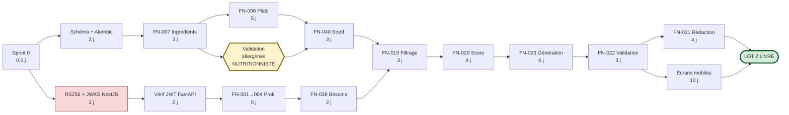

# ARISE Nutrition — Grille d'analyse des fonctionnalités

> Document d'aide à la décision, établi après audit du code existant (`arise_BE`, `Arise`, `NUTRITION-ARISE`).
> Complète — sans la remplacer — la spécification `ARISE_Module_Nutrition_Fonctionnalites.md` v2.0.
> **La spécification dit *quoi* construire. Ce document dit *ce qui existe déjà*, *ce que ça coûte* et *où sont les pièges*.**

---

## 1. Mode d'emploi

### Légende

| Symbole | Signification |
|---|---|
| **Complexité** ●○○ | Travail mécanique, sans inconnue |
| **Complexité** ●●○ | Logique métier réelle, à concevoir |
| **Complexité** ●●● | Algorithmique ou intégration à inconnues |
| **Risque** 🟢 | Maîtrisé |
| **Risque** 🟡 | Dépend d'une hypothèse ou d'un travail non technique |
| **Risque** 🔴 | Peut bloquer la livraison ou engager la responsabilité |
| **Existant** ✅ | Réutilisable tel quel ou avec adaptation mineure |
| **Existant** 🔧 | Existe mais doit être modifié |
| **Existant** ❌ | À créer intégralement |

### Unité d'effort

Les estimations sont en **jours-développeur (j)**, pour un développeur familier de la stack.
Elles **excluent** : la production de contenu (saisie des plats, photos), la validation nutritionniste, la recette fonctionnelle et les imprévus.
**Prévoir +20 % de marge** sur tout engagement de planning.

---

## 2. Inventaire de l'existant réutilisable

C'est le principal levier de réduction d'effort. Une grande partie de l'infrastructure transverse est déjà écrite.

### 2.1 Backend NestJS — `arise_BE`

| Élément | Fichier | Usage pour le module Nutrition |
|---|---|---|
| 🔧 Infrastructure JWT | [jwt.strategy.ts](../arise_BE/src/auth/strategies/jwt.strategy.ts) · [auth.service.ts:166](../arise_BE/src/auth/auth.service.ts#L166) | À migrer HS256 → RS256 + JWKS. **Seul chantier NestJS structurant.** |
| ✅ Garde de rôles | [roles.guard.ts](../arise_BE/src/common/roles.guard.ts) · [roles.decorator.ts](../arise_BE/src/common/roles.decorator.ts) · [role.enum.ts](../arise_BE/src/common/role.enum.ts) | Modèle à transposer en dépendances FastAPI. Ajouter le rôle `nutritionist`. |
| ✅ Décorateur utilisateur courant | [current-user.decorator.ts](../arise_BE/src/common/current-user.decorator.ts) | Équivalent direct de la dépendance `get_current_user` |
| ✅ Journal d'audit | `src/audit/audit-log.entity.ts` · `audit-log.interceptor.ts` | **Schéma et interception déjà conçus** → FN-036 se réduit à une transposition |
| ✅ Enveloppe d'erreur | [global-exception.filter.ts](../arise_BE/src/filters/global-exception.filter.ts) | Format de réponse d'erreur à reproduire pour la cohérence mobile (FN-037) |
| 🔧 Identifiant de requête | [request-tracker.middleware.ts:32](../arise_BE/src/middleware/request-tracker.middleware.ts#L32) | Génère son propre `X-Request-ID` mais **n'accepte pas un identifiant entrant**. Une modification est nécessaire pour la corrélation mobile → NestJS → FastAPI (FN-036). |
| ✅ Masquage des données sensibles | [request-tracker.middleware.ts:88-133](../arise_BE/src/middleware/request-tracker.middleware.ts#L88-L133) | Liste de champs à masquer, à étendre aux données de santé |
| 🔧 Cible du *strangler fig* | [menu.entity.ts](../arise_BE/src/programme/entities/menu.entity.ts) · [meal-type.entity.ts](../arise_BE/src/programme/entities/meal-type.entity.ts) | `meal_types` est déjà seedée par migration. Ajout de `dishId` au lot 2. |
| ✅ Source des droits | [subscription.entity.ts](../arise_BE/src/programme/entities/subscription.entity.ts) | Alimente le claim `entitlements` |
| 🔧 Infrastructure Postgres | [docker-compose.yml](../arise_BE/docker-compose.yml) | Postgres 15 sur le port **5433**, alors que `.env` pointe sur 5432 → incohérence à lever. Image `pgvector/pgvector` requise au lot 4. |

### 2.2 Application mobile — `Arise`

**Le socle UI nécessaire au lot 2 est déjà largement présent.**

| Composant | Fichier | Écran cible |
|---|---|---|
| ✅ `DishCard` | `src/components/ui/DishCard.tsx` | MOB-005, MOB-006 — **le composant de plat existe déjà** |
| ✅ `MealTypeTab` | `src/components/ui/MealTypeTab.tsx` | MOB-005 — onglets petit-déjeuner / déjeuner / dîner |
| ✅ `CalendarDay` | `src/components/ui/CalendarDay.tsx` | MOB-005 — navigation par jour |
| ✅ `ProgressBar` | `src/components/ui/ProgressBar.tsx` | MOB-001 — apport du jour vs cible calorique |
| ✅ `StatCard` | `src/components/ui/StatCard.tsx` | MOB-001, MOB-009 |
| ✅ `DataTable` | `src/components/ui/DataTable.tsx` | Écrans admin, comparaison de vendeurs |
| ✅ `Toast` / `ToastContainer` | `src/components/ui/Toast.tsx` | Restitution des erreurs FN-037 |
| ✅ Écran menu existant | [menu.tsx](../Arise/src/app/(user)/menu.tsx) | Base de MOB-005 — la navigation semaine et le mapping des types de repas sont écrits |
| ✅ Typage des repas | `src/types/menu.ts` | Types `MealType` déjà définis |
| ✅ Client HTTP | [axiosInstance.ts](../Arise/src/api/config/axiosInstance.ts) | Rafraîchissement de token, file d'attente, redirection : **à dupliquer pour la base FastAPI**, logique réutilisable telle quelle |
| ✅ Motif d'import | `src/store/slices/importSlice.ts` | Un flux d'import existe déjà → modèle pour FN-014 |
| ✅ `expo-document-picker` | `package.json` | **Déjà installé** → le téléversement CSV du lot 3 ne coûte rien |
| ✅ `react-native-chart-kit` | `package.json` | **Déjà installé** → graphiques nutritionnels sans dépendance supplémentaire |

> **Conséquence** : l'effort mobile du lot 2 porte sur les écrans et la logique d'état, pas sur la brique UI. C'est ce qui rend l'estimation de 10 j tenable.

### 2.3 Service FastAPI — `NUTRITION-ARISE`

| Élément | État |
|---|---|
| 🔧 `app/main.py` | `/health` existe mais **répond toujours « healthy »**, même base coupée. À rendre réel. |
| ✅ `app/routers/ai_test.py` | Appel OpenRouter fonctionnel, **renvoie déjà `usage`** → germe du `LLMClient` et de la journalisation de coût (FN-021) |
| 🔧 `app/config.py` | `pydantic-settings` en place, mais **une seule variable** (`open_router_key`) |
| ✅ Dépendances présentes | FastAPI 0.140, SQLAlchemy 2.0, Alembic 1.18, psycopg 3, Jinja2, PyYAML, httpx, python-multipart, sentry-sdk |
| ❌ Dépendances manquantes | `pyjwt[crypto]` (lot 1) · `pytest`, `pytest-asyncio` (lot 1) · `openpyxl` (lot 3) · `pgvector` + modèle d'embeddings (lot 4) |
| ❌ Alembic | Installé mais **non initialisé** (`alembic.ini` absent) |
| ❌ Base de données | **`arise_nutrition` n'existe pas.** Bases présentes : `arise`, `kidinov`, `postgres` |
| 🔴 `requirements.txt` | Encodé en **UTF-16LE** → `pip install -r` échoue |
| 🔴 `.env` | Clé OpenRouter en clair |
| ⚠ Python 3.14.6 | OK pour les lots 1–3. Risque de wheels manquantes au lot 4 (torch / sentence-transformers). |
| ⚠ pgvector | **Non disponible** sur l'instance Postgres actuelle. Sans effet avant le lot 4. |

---

## 3. Grille de synthèse — les 40 fonctionnalités

### Lot 1 — Fondations · 28 j

| FN | Fonctionnalité | Cplx | Risque | Effort | Existant | Dépend de |
|---|---|---|---|---|---|---|
| — | **Sprint 0** (env, base, Alembic, arborescence) | ●○○ | 🟢 | 0,5 j | 🔧 | — |
| — | **Migration RS256 + JWKS** (NestJS) | ●●○ | 🟡 | 2 j | 🔧 auth | — |
| — | Schéma SQLAlchemy + migration initiale | ●●○ | 🟢 | 2 j | ❌ | Sprint 0 |
| — | Vérification JWT côté FastAPI (JWKS, cache, `kid`) | ●●○ | 🟢 | 2 j | ✅ modèle NestJS | RS256 |
| FN-001 | Profil nutritionnel | ●○○ | 🟢 | 1,5 j | ❌ | Schéma, JWT |
| FN-002 | Préférences alimentaires | ●○○ | 🟢 | 1 j | ❌ | FN-001 |
| FN-003 | **Allergies** | ●●○ | 🔴 | 1 j | ❌ | FN-001 |
| FN-004 | Restrictions alimentaires | ●●○ | 🟡 | 1,5 j | ❌ | FN-001 |
| FN-007 | Catalogue d'ingrédients | ●●○ | 🟡 | 3 j | ❌ | Schéma |
| FN-008 | Catalogue de plats + workflow de statuts | ●●○ | 🟢 | 5 j | ❌ | FN-007 |
| FN-009 | Tags et classification | ●○○ | 🟢 | 1 j | ❌ | FN-008 |
| FN-040 | **Seed du catalogue** (outil + données) | ●●○ | 🔴 | 3 j | ❌ | FN-008 |
| FN-034 | Interface HTML de saisie et validation | ●○○ | 🟢 | 4 j | ❌ | FN-008 |
| FN-036 | Journalisation | ●○○ | 🟢 | 1 j | ✅ audit NestJS | Schéma |
| FN-037 | Gestion des erreurs | ●○○ | 🟢 | 1 j | ✅ filtre NestJS | — |

### Lot 2 — Générateur · 43 j

| FN | Fonctionnalité | Cplx | Risque | Effort | Existant | Dépend de |
|---|---|---|---|---|---|---|
| FN-038 | **Besoins énergétiques et macros** | ●●○ | 🟡 | 2 j | ❌ | FN-001 |
| FN-039 | **Limites de sécurité médicale** | ●○○ | 🔴 | 1 j | ❌ | FN-038 |
| FN-019 | Filtrage déterministe (SQL) | ●●○ | 🔴 | 3 j | ❌ | FN-003, FN-008 |
| FN-020 | Score métier et sélection | ●●● | 🟡 | 4 j | ❌ | FN-019 |
| FN-024 | Gestion de la variété | ●●○ | 🟢 | 2 j | ❌ | FN-020 |
| FN-023 | Génération + figement + exécution asynchrone | ●●● | 🟡 | 6 j | ❌ | FN-020, FN-038 |
| FN-021 | Rédaction LLM + repli + journal de coût | ●●○ | 🟡 | 4 j | ✅ `ai_test.py` | FN-023 |
| FN-022 | **Validation finale** | ●●○ | 🔴 | 3 j | ❌ | FN-023 |
| FN-025 | Regénération et remplacement | ●●○ | 🟢 | 3 j | ❌ | FN-023 |
| FN-031 | Suivi d'un repas | ●○○ | 🟢 | 1 j | ❌ | FN-023 |
| FN-032 | Feedback | ●○○ | 🟢 | 1 j | ❌ | FN-023 |
| FN-033 | Historique des programmes | ●○○ | 🟢 | 2 j | ❌ | FN-023 |
| MOB | Écrans 001, 002, 003, 004, 005, 006, 009 | ●●○ | 🟢 | 10 j | ✅ socle UI | API lot 2 |
| — | Colonne `dishId` sur `menus` (NestJS) | ●○○ | 🟢 | 1 j | 🔧 | FN-008 |

### Lot 3 — Achats · 41 j

| FN | Fonctionnalité | Cplx | Risque | Effort | Existant | Dépend de |
|---|---|---|---|---|---|---|
| FN-010 | Points de vente | ●○○ | 🟢 | 2 j | ❌ | Schéma |
| FN-011 | Produits commerciaux | ●●○ | 🟡 | 2 j | ❌ | FN-007, FN-010 |
| FN-015 | **Saisie manuelle de prix** | ●○○ | 🟡 | 3 j | ❌ | FN-011 |
| FN-014 | Import CSV / XLSX | ●●○ | 🟡 | 4 j | ✅ `importSlice` | FN-011 |
| FN-012 | **Normalisation des unités** | ●●● | 🔴 | 4 j | ❌ | FN-007 |
| FN-016 | Historique, agrégats et fraîcheur | ●●○ | 🟢 | 3 j | ❌ | FN-015 |
| FN-026 | Liste d'achats | ●●● | 🟡 | 5 j | ❌ | FN-012, FN-023 |
| FN-027 | Sélection des conditionnements | ●●○ | 🟡 | 3 j | ❌ | FN-026 |
| FN-028 | Optimisation des achats | ●●● | 🟡 | 5 j | ❌ | FN-027 |
| FN-005 | Budget (volet prix réels) | ●●○ | 🟢 | 1 j | ❌ | FN-026 |
| FN-029 | Adaptation au budget faible | ●●○ | 🟡 | 2 j | ❌ | FN-028 |
| FN-030 | Comparaison des vendeurs | ●○○ | 🟢 | 2 j | ✅ `DataTable` | FN-016 |
| MOB | Écrans 007, 008 | ●●○ | 🟢 | 6 j | ✅ socle UI | API lot 3 |

### Lot 4 — Automatisation · 26 j · ⚠ conditionnel

| FN | Fonctionnalité | Cplx | Risque | Effort | Existant | Dépend de |
|---|---|---|---|---|---|---|
| — | **SPIKE-01** — validation des sources | ●○○ | 🔴 | 0,5 j | ❌ | — |
| FN-013 | Connecteurs de scraping (× 2) | ●●● | 🔴 | 8 j | ❌ | **SPIKE-01** |
| FN-017 | Planification et reprise sur échec | ●●○ | 🟡 | 3 j | ❌ | FN-013 |
| FN-018 | Indexation vectorielle | ●●○ | 🟡 | 4 j | ❌ | pgvector + modèle |
| FN-019b | Recherche sémantique hybride | ●●● | 🟡 | 4 j | ❌ | FN-018 |
| FN-028b | Optimisation par distance réelle | ●●○ | 🟡 | 3 j | ❌ | FN-028 |
| FN-035 | Tableau de bord de supervision | ●○○ | 🟢 | 4 j | ✅ `StatCard` | Tous |

---

## 4. Récapitulatif d'effort

| Lot | Effort | Cumul | Livrable |
|---|---|---|---|
| **1 — Fondations** | 28 j | 28 j | Catalogue saisi, validé, publiable |
| **2 — Générateur** | 43 j | 71 j | **Promesse produit démontrable, sans données de prix** |
| **3 — Achats** | 41 j | 112 j | Liste de courses chiffrée |
| **4 — Automatisation** | 26 j | 138 j | Fraîcheur des prix sans effort manuel *(conditionnel)* |

### Traduction en calendrier

| Effectif | Lots 1+2 | Lots 1→3 | Total |
|---|---|---|---|
| 1 développeur | ~4 mois | ~6,5 mois | ~8 mois |
| 2 développeurs | ~2,5 mois | ~4 mois | ~5 mois |

Hypothèses : 18 jours travaillés par mois, marge de 20 % incluse, parallélisation imparfaite à deux.

### Ce que ces chiffres n'incluent pas

| Poste | Nature | Ordre de grandeur |
|---|---|---|
| Saisie et validation des 180 plats | Contenu + nutritionniste | 15–25 j non-développeur |
| Photographies des plats | Contenu | Variable — **à arbitrer tôt** (Q-05) |
| Collecte terrain des prix (lot 3) | Opérationnel, **récurrent** | 2–4 j/mois en continu |
| Recette fonctionnelle et correction | QA | +15 à 20 % |

> ⚠ **La collecte de prix est un coût récurrent, pas un coût de projet.** C'est le point le plus souvent sous-estimé : le lot 3 ne « se termine » pas, il crée une obligation opérationnelle permanente. C'est l'argument le plus fort en faveur du lot 4 — et la raison pour laquelle son échec (SPIKE-01) doit orienter vers la contribution communautaire.

---

## 5. Chemin critique



### Les deux chemins à démarrer immédiatement

1. **RS256 + JWKS côté NestJS** — ne dépend de rien, bloque toute l'authentification FastAPI ;
2. **Recrutement du nutritionniste** — travail non technique, **délai d'obtention non maîtrisé**, et bloque le seed donc tout le lot 2.

Le second est le plus dangereux : il ne coûte aucun jour-développeur, mais il peut immobiliser l'équipe pendant des semaines s'il est lancé tard. **C'est la première action à engager, avant toute ligne de code.**

---

## 6. Matrice valeur × risque

```text
   VALEUR
   élevée │  FN-023 Génération        │  FN-003 Allergies
          │  FN-020 Score             │  FN-040 Seed
          │  FN-038 Besoins           │  FN-012 Normalisation unités
          │  Écrans mobiles           │  FN-022 Validation
          │                           │
          │  ── à faire, maîtrisé ──  │  ── à sécuriser en priorité ──
   ───────┼───────────────────────────┼──────────────────────────────
          │  FN-030 Comparaison       │  FN-013 Scraping
          │  FN-033 Historique        │  FN-019b Recherche sémantique
   faible │  FN-035 Tableau de bord   │  FN-028b Distance
          │                           │
          │  ── à faire en dernier ── │  ── à ne pas engager ──
          └───────────────────────────┴──────────────────────────────
              risque faible               risque élevé
```

**Lecture** : le quadrant en bas à droite (scraping, recherche sémantique, distance) concentre le risque **sans** porter la valeur produit. C'est exactement le contenu du lot 4 — et la justification de son caractère conditionnel.

---

## 7. Analyse détaillée des points durs

Seules les fonctionnalités porteuses de risque ou de complexité réelle sont détaillées. Les autres sont du travail mécanique correctement décrit par la spécification.

---

### 🔴 FN-003 — Allergies · 1 j de code, risque maximal

**Le paradoxe** : la fonctionnalité la moins coûteuse à développer est la plus risquée du projet.

**Pourquoi** : le code est trivial (une jointure d'exclusion). Le risque est ailleurs — dans la **qualité de la donnée** et dans la **responsabilité engagée**. Un faux négatif n'est pas un bug, c'est un incident potentiellement grave.

**Points de vigilance**
- La propagation indirecte (allergène porté par un ingrédient composé) est la source d'erreur la plus probable.
- La double vérification (avant sélection, après rédaction LLM) doit être **effective**, pas déclarative.
- La règle « un ingrédient non vérifié rend le plat non publiable » va bloquer massivement au démarrage. **C'est voulu** — mais l'équipe doit y être préparée, sinon la tentation de désactiver le contrôle sera forte.

**Vérification** : les tests §14.1 de la spécification doivent tous passer, y compris le cas d'une réponse LLM forgée contenant un allergène.

---

### 🔴 FN-040 — Seed du catalogue · 3 j de code, 15–25 j de contenu

**Le vrai goulot d'étranglement du projet.** L'outillage est rapide à écrire ; la production du contenu ne l'est pas, et elle n'est pas parallélisable par des développeurs.

**Volumétrie** : ~150 ingrédients, ~180 plats publiés, **100 % des allergènes vérifiés**.

**Points de vigilance**
- Ne pas saisir dans une interface web : YAML versionné + script idempotent (D-12). Sinon aucune relecture, aucune reproductibilité entre environnements.
- Les valeurs nutritionnelles doivent venir d'une table de composition reconnue (FAO/INFOODS Afrique de l'Ouest en priorité), jamais d'une estimation.
- **À lancer dès le premier jour du lot 1**, en parallèle du développement.

**Signal d'alerte** : si à mi-parcours du lot 1 moins de 60 plats sont saisis, le lot 2 glissera mécaniquement.

---

### 🟡 FN-020 — Score métier · 4 j, complexité algorithmique

**La difficulté n'est pas d'écrire la formule, c'est de la calibrer.** Onze termes pondérés, dont l'équilibre ne se découvre qu'à l'usage.

**Points de vigilance**
- Poids **en base**, jamais en dur — sinon chaque ajustement devient un déploiement.
- `scoring_version` enregistrée à chaque génération : sans elle, une régression de qualité est indébuggable.
- Graine aléatoire enregistrée pour départager les ex æquo → générations reproductibles, indispensable au débogage.
- Prévoir explicitement **2 à 3 j de calibrage** après les premières générations réelles. Ce n'est pas du correctif, c'est du réglage.

---

### 🟡 FN-023 — Génération · 6 j, la pièce maîtresse

**Le point le plus souvent négligé : le figement des plats.** Sans copie complète du plat dans `meal_plan_meals`, modifier ou archiver un plat réécrit rétroactivement l'historique de tous les utilisateurs.

**Points de vigilance**
- Boucle de correction calorique bornée à 3 itérations, sinon risque de non-convergence.
- Exécution asynchrone au-delà de 5 s : `202 Accepted` + `job_id`. À concevoir dès le départ, pas à rajouter après.
- Échec explicite plutôt que programme partiel. Un programme incomplet livré silencieusement est pire qu'une erreur.

---

### 🔴 FN-022 — Validation finale · 3 j, dernier rempart

**Onze contrôles, dont quatre sont des contrôles de sécurité alimentaire.**

**Points de vigilance**
- Ne doit **jamais** être désactivable, même en test — c'est précisément en test qu'on prend l'habitude de le contourner.
- Un échec sur les contrôles 1 à 4 est un incident de production, pas un log. Alerte immédiate.
- L'indicateur « incidents de restriction » du tableau de bord doit rester à zéro. Toute autre valeur est traitée comme un incident.

---

### 🟡 FN-021 — Rédaction LLM · 4 j, coût à maîtriser

**Déjà amorcé** : [ai_test.py](app/routers/ai_test.py) contient l'appel OpenRouter fonctionnel et renvoie `usage`. C'est le germe direct du `LLMClient` et de la journalisation de coût.

**Points de vigilance**
- **Un seul appel par programme.** À protéger par un test automatisé, sinon la dérive vers un appel par repas est quasi certaine lors d'une refonte.
- Le repli textuel n'est pas optionnel : c'est lui qui rend le fournisseur IA non bloquant. **À écrire en premier**, avant l'appel LLM lui-même.
- Quota dur côté serveur, pas une alerte. Une boucle de retry un dimanche soir vide un crédit.
- Le modèle ne produit **aucun chiffre** : calories, prix et quantités sont injectés après rédaction. Contrôle n° 11 de FN-022.

---

### 🔴 FN-012 — Normalisation des unités · 4 j, complexité sous-estimée

**Le piège classique du projet.** Les conversions génériques (kg ↔ g) sont triviales ; les conversions réelles ne le sont pas.

**Cas réels à traiter** : *kapoaka* de riz, botte de brèdes, tas de tomates, 1 poulet, 1 tête d'ail, poids ↔ volume dépendant de la densité.

**Points de vigilance**
- Une table de conversion **par ingrédient** est indispensable. Une formule générique produira des quantités fausses, donc des listes de courses fausses, donc une perte de confiance immédiate.
- Chaque conversion locale doit être **mesurée puis validée**, jamais estimée.
- Une conversion absente doit **bloquer le chiffrage et le signaler**, jamais inventer un facteur.

---

### 🟡 FN-026 à FN-028 — Chaîne d'achat · 13 j cumulés

**Trois fonctionnalités fortement couplées** : liste d'achats → conditionnements → optimisation. Elles se conçoivent ensemble et se testent ensemble.

**Points de vigilance**
- FN-028 est un problème d'optimisation combinatoire. **Assumer l'heuristique gloutonne** et l'expliquer à l'utilisateur (« mode pratique : 2 magasins, ~8 % au-dessus du minimum théorique »). Chercher l'optimum coûterait des semaines pour un gain imperceptible.
- Un ingrédient sans prix connu doit être affiché et exclu du total, jamais estimé silencieusement.
- Les totaux sont des fourchettes. Un chiffre unique sur un marché négocié détruit la crédibilité dès la première course réelle.

---

### 🔴 FN-013 — Scraping · 8 j, entièrement conditionnel

**Ne pas engager avant SPIKE-01.** Une demi-journée de vérification décide de huit jours de développement et d'une dette de maintenance permanente (un site qui change de structure casse un connecteur).

**Si SPIKE-01 échoue** : le lot 4 est abandonné en l'état, et l'effort est réinvesti dans la contribution communautaire de prix. L'architecture `price_observations` (D-08) rend cette bascule sans coût — `collection_method` accepte déjà la valeur `user`.

---

### 🟡 FN-018 / FN-019b — Recherche vectorielle · 8 j, différée à raison

**Deux constats de l'audit confortent le report** :

1. **pgvector n'est pas disponible** sur l'instance Postgres actuelle — l'activer suppose une extension ou l'image `pgvector/pgvector` ;
2. **Python 3.14.6** est très récent : les wheels de `torch` / `sentence-transformers` peuvent manquer, ce qui compliquerait un modèle d'embeddings local.

Sur 200–500 plats avec des filtres durs, le SQL indexé est plus pertinent et environ 100× plus rapide. Les colonnes `dish_embeddings` figurent au schéma dès le lot 1 pour éviter une migration ultérieure — c'est le seul coût à payer maintenant.

---

## 8. Les 12 pièges, par gravité

| # | Piège | Conséquence | Parade |
|---|---|---|---|
| 1 | Développer sans figer les plats dans le programme | Historique faux, suivi ininterprétable | `dish_snapshot` dès FN-023 |
| 2 | Désactiver FN-022 « le temps des tests » | Incident de sécurité alimentaire en production | Contrôle non désactivable par construction |
| 3 | Démarrer le seed en fin de lot 1 | Lot 2 non démontrable, équipe à l'arrêt | Lancer le contenu **au jour 1** |
| 4 | Partager `JWT_SECRET` avec FastAPI | FastAPI peut forger des tokens admin ARISE | RS256 + JWKS |
| 5 | Un appel LLM par repas | Coût × 60, latence rédhibitoire | Test automatisé sur le nombre d'appels |
| 6 | Formule de conversion d'unités générique | Quantités fausses, listes de courses fausses | Table par ingrédient, conversions mesurées |
| 7 | Afficher un prix exact | Promesse intenable, crédibilité perdue | Fourchettes systématiques |
| 8 | Écrire le scraping avant SPIKE-01 | 8 j perdus | Condition de démarrage formelle |
| 9 | Estimer un prix manquant silencieusement | Budget faux, confiance perdue | « Prix inconnu » explicite, exclu du total |
| 10 | Deux back-offices (mobile + Jinja2) | Double maintenance permanente | HTML = outil interne uniquement |
| 11 | Poids de scoring en dur dans le code | Chaque réglage devient un déploiement | Poids en base, versionnés |
| 12 | Oublier la propagation de l'identifiant de corrélation | Débogage impossible en production | Modifier `request-tracker.middleware.ts` |

---

## 9. Questions à trancher, par échéance

| Échéance | ID | Question | Bloque |
|---|---|---|---|
| **Immédiat** | Q-01 | Qui est le nutritionniste validateur, sous quel contrat ? | Le seed, donc le lot 2 |
| **Immédiat** | H-01 | Réutilisation hors ARISE, ou seulement de l'écosystème Python ? | Identifiant opaque vs UUID ARISE |
| Avant lot 2 | Q-02 | Nutrition incluse dans l'abonnement ou vendue à part ? | Contenu du claim `entitlements` |
| Avant lot 2 | Q-04 | Budget IA mensuel plafond et quota par utilisateur ? | Valeur du quota dur |
| Avant lot 2 | Q-05 | Qui produit les photographies des plats ? | Qualité perçue des écrans |
| Avant lot 3 | Q-03 | Quels quartiers d'Antananarivo pour le MVP prix ? | Périmètre de collecte |
| Avant lot 4 | SPIKE-01 | Deux sources de prix scrapables existent-elles ? | Existence du lot 4 |

---

## 10. Dette technique existante à traiter en parallèle

Ces points concernent le code déjà en production et ne font partie d'aucun lot. Ils doivent être traités indépendamment.

| Gravité | Point | Localisation | Effort |
|---|---|---|---|
| 🔴 | `.env` suivi par git avec secrets réels (MVola, Gmail, JWT) | `arise_BE/.env` | 0,5 j + rotation |
| 🔴 | `synchronize: true` cohabite avec 17 migrations | [app.module.ts:52](../arise_BE/src/app.module.ts#L52) | 0,5 j |
| 🔴 | `JWT_SECRET` resté à sa valeur d'exemple | `arise_BE/.env` | Rendu caduc par RS256 |
| 🟠 | Clé OpenRouter en clair | `NUTRITION-ARISE/.env` | Rotation |
| 🟠 | `requirements.txt` en UTF-16LE | `NUTRITION-ARISE/` | 5 min |
| 🟡 | `docker-compose` sur 5433, `.env` sur 5432 | `arise_BE/` | 15 min |
| 🟡 | `/health` répond toujours « healthy » | [main.py:21](app/main.py#L21) | 30 min |

---

## 11. Synthèse en cinq points

1. **Le projet est faisable.** ~138 j-développeur au total, dont **71 j pour atteindre la promesse produit** (lots 1 et 2).
2. **Le lot 2 est le vrai jalon.** Il délivre la valeur sans dépendre d'aucune donnée de prix — donc sans dépendre du principal risque.
3. **Le goulot d'étranglement n'est pas technique.** C'est la production du catalogue et la validation nutritionniste : à engager avant toute ligne de code.
4. **L'existant réduit fortement l'effort.** Journal d'audit, gestion d'erreurs, garde de rôles, `DishCard`, `MealTypeTab`, `CalendarDay`, `expo-document-picker`, `react-native-chart-kit` : l'infrastructure transverse et le socle UI sont déjà là.
5. **Le lot 4 concentre le risque sans porter la valeur.** Son abandon éventuel est prévu par l'architecture et n'affecte aucun lot antérieur.
